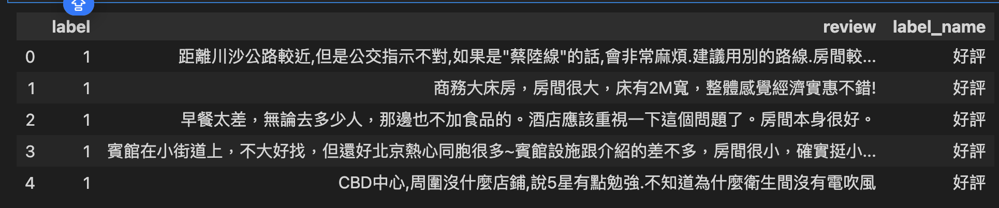
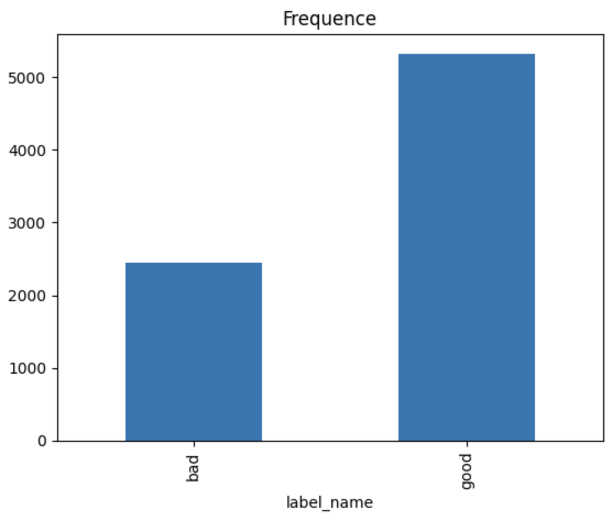
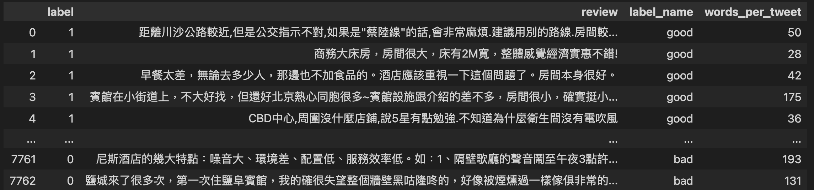
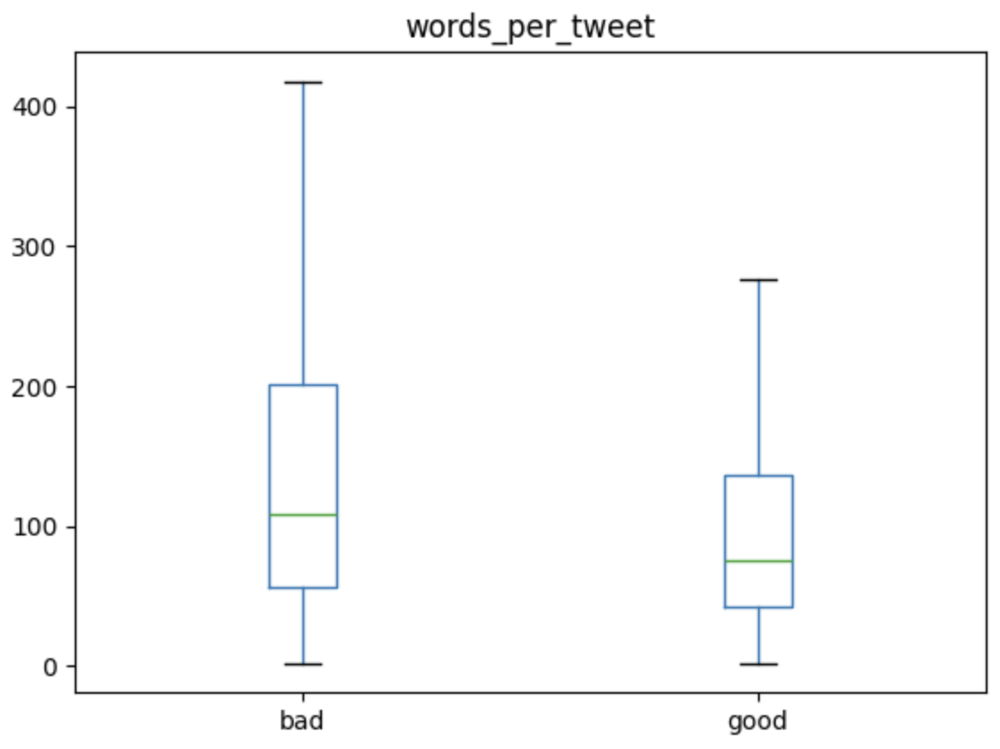
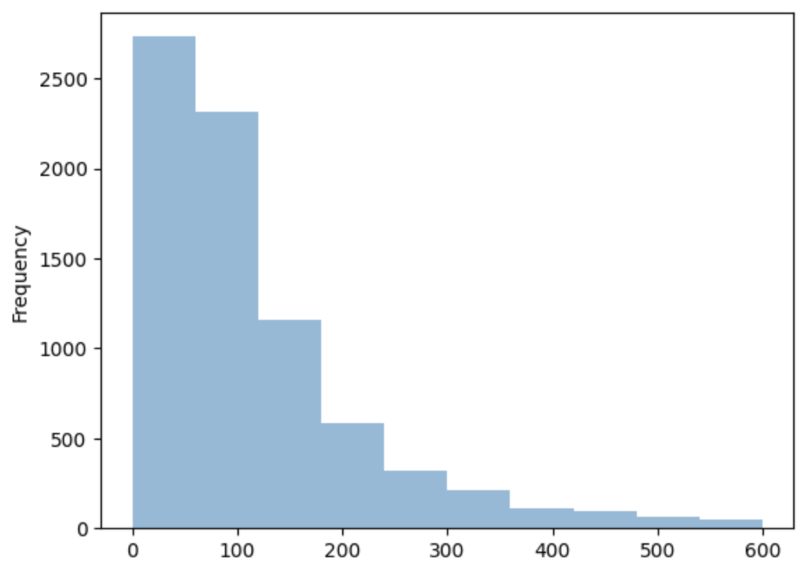

## 分析資料_圖表化

- 依據ChnSentiCorp_htl_all.csv

**使用pandas讀入資料**

```python
import pandas as pd

data = pd.read_csv('ChnSentiCorp_htl_all.csv')
data = data.dropna()
data.info()

#==output==
<class 'pandas.core.frame.DataFrame'>
Index: 7765 entries, 0 to 7765
Data columns (total 2 columns):
 #   Column  Non-Null Count  Dtype 
---  ------  --------------  ----- 
 0   label   7765 non-null   int64 
 1   review  7765 non-null   object
dtypes: int64(1), object(1)
memory usage: 182.0+ KB
```

**將label欄位加入文字說明**

```python
from pandas import Series
def apply_func(value:int)->str:
    if value == 0:
        return 'bad'
    else:
        return 'good'
    
label_name:Series = data['label'].apply(apply_func)
data['label_name'] = label_name
data.head()
```



**顯示好評和壞評數量圖表**

- 使用value_counts()

```python
import matplotlib.pyplot as plt
data['label_name'].value_counts(ascending=True).plot.bar()
plt.title('Frequence')
plt.show()
```



**計算文字的數量**

```python
data['words_per_tweet']= data['review'].str.len()
data
```



**顯示boxplot,了解大約好評,壞評的文字數量**
- boxplot()

```python
import matplotlib.pyplot as plt

data.boxplot(column='words_per_tweet',
             by='label_name',
             grid=False,
             showfliers=False)
plt.suptitle("")
plt.xlabel('')
plt.show()
```



**使用直方圖(histogram)**

```python
data['words_per_tweet'].plot.hist(alpha=0.5,range=(0,600))
```




