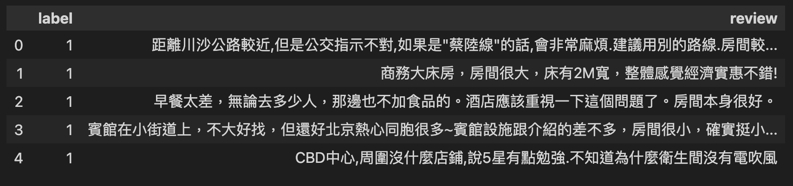

## 使用pytorch的Dataset
### 最終目標訓練的資料集格式
- dictionary
	- input_ids:tensor
	- token_type_ids:tensor
	- attention_mask:tensor
	- labels:tensor

| input_ids | toke_type_ids | attention_mast | labels |
|:--|:--|:--|:--|
| tensor | tensor | tensor | tensor |

### 步驟1-資料轉換和整理
- 使用pandas
- info(),dropna(),len()

```python
import pandas as pd

data = pd.read_csv('ChnSentiCorp_htl_all.csv')
data.head()
```



---

```python
data = data.dropna()
len(data)

#==output==
7765
```

### 步驟2-將資料轉換成為DataSet格式
- 必需自訂類別繼承Dataset類別
- 建立實體有iterable和subscript的能力(實體[index])
- 實作__len__
- 實作__getitem__,傳出tuple資料

```python
from torch.utils.data import Dataset

class HotelDataSet(Dataset):
    def __init__(self):
        super().__init__()
        data = pd.read_csv('ChnSentiCorp_htl_all.csv')
        self.data = data.dropna()

    def __len__(self):
        return len(self.data)
    
    def __getitem__(self, index): #傳出tuple
        return self.data.iloc[index]['review'], self.data.iloc[index]['label']

hotelDataSet = HotelDataSet()
hotelDataSet[0]

#==output==
('距離川沙公路較近,但是公交指示不對,如果是"蔡陸線"的話,會非常麻煩.建議用別的路線.房間較為簡單.', np.int64(1))
```

### 步驟3-分組(切割)Dataset,成為trainset和validset2組
- random_split() - 切割和重新隨機排序
- 傳出Subset類別

```python
from torch.utils.data import random_split

trainset, validset= random_split(hotelDataSet,lengths=[0.9,0.1])
trainset[0], len(trainset), len(validset)

#==output==
(('因為公司的報銷制度嚴格,所以我在酒店結帳的時候讓前臺在列印出來的明細單上加蓋酒店的章(大家說這個要求過分嗎),但是前臺小姐以各種理由拒不蓋章,試問如果出差回去不能報銷費用的話,這樣的酒店誰還敢住?如果不是急著趕飛機的話,一定要找酒店要個說法!建議報銷制度嚴格的朋友不要考慮這個酒店了.',
  np.int64(0)),
 6989,
 776)
```

### 步驟4-使用DataLoader類別分批

- 一批的資料格式list[tuple | tensor] -> 2維資料

```python
from torch.utils.data import DataLoader

trainDataLoader = DataLoader(trainset, batch_size=3, shuffle=True)
validDataLoader = DataLoader(validset, batch_size=32, shuffle=True)
next(enumerate(trainDataLoader))[1]

#==output==
[('酒店位置不錯，交通方便。硬體環境雖然顯得比較舊了，但依舊不失檔次。服務態度基本令人滿意。寬頻網路速度不錯，就是還需要單獨聯絡前臺開通帳號且沒有什麼提示說明，不大方便。房間裡準備了滅蚊器，但是沒有藥片，需要自己聯絡服務員索取。離店那天的早餐不大理想，還沒到結束時間（差一小時），我們一邊吃，服務員一邊在旁邊就把各種餐具、菜品收走了，令人感覺比較尷尬。另外，在衛生間看到',
  '大堂顯得太小,服務周到細緻,我下次一定會在入住.',
  '感覺還不錯，雖然不算新也不算豪華。地下一層的桑那按摩（當然應該是獨立經營的）騙錢，故意不說要加房間錢。'),
 tensor([1, 1, 1])]
```

**套用collate_fn,傳出dictionary**

```python
from torch.utils.data import DataLoader
import torch
def collate_func(batch):
    """
    將batch的資料轉換為訓練需要的格式
    Param:
        每個批次,list內有2個元素,第1個元素為文字,第2個元素為label
    Return:
        傳出一個批次訓練需要的dictionary
    """
    
    #使用取出文字和label
    reviews , labels = [],[]
    for item in batch:
        reviews.append(item[0])
        labels.append(item[1])

    return {'text':reviews, 'label':torch.tensor(labels)}


trainDataLoader = DataLoader(trainset, batch_size=3, shuffle=True,collate_fn=collate_func)
validDataLoader = DataLoader(validset, batch_size=64, shuffle=True)
next(enumerate(trainDataLoader))[1]

#==output==
{'text': ['地理位置不錯，就是臨街有點吵，其他都不錯',
  '酒店設施一流，房間設施一流，前臺及銷售人員服務非常令人滿意，我因為是陪同客人去旅遊，旅遊路線不瞭解，詢問了酒店總檯，總檯馬上安排酒店銷售人員熱情為我一一解答，銷售人員還提出如有需要可以陪同我們一起前往旅遊景點，讓人有賓至如歸的感覺真的非常不錯，但美中不足的是酒店的早餐，我一共入住酒店2次，每次早上我大約都在9點去餐廳用早餐（9：30結束），但是每次都是沒有什麼可以吃的了，每次都有很多客人都在向服務員抱怨，而服務員也沒有作出進一步的反應，我覺得這與五星級的酒店不太相忖，希望酒店能予以改進。',
  '設施雖稍陳舊一些,但良好的服務給人溫暖.酒店所處地理位置和環境極好.對年齡較大的個人旅遊者而言,入住該酒店不失為較佳選擇.'],
 'label': tensor([1, 1, 1])}
```

**tokenize 文字**

```python

from torch.utils.data import DataLoader
import torch
from transformers import AutoTokenizer

tokenizer = AutoTokenizer.from_pretrained("google-bert/bert-base-chinese")

def collate_func(batch):
    """
    將batch的資料轉換為訓練需要的格式
    Param:
        每個批次,list內有2個元素,第1個元素為文字,第2個元素為label
    Return:
        傳出一個批次訓練需要的dictionary
    """
    
    #使用取出文字和label
    reviews , labels = [],[]
    for item in batch:
        reviews.append(item[0])
        labels.append(item[1])

    inputs = tokenizer(reviews,max_length=128,padding='max_length',truncation=True,return_tensors='pt')
    inputs['labels'] = torch.tensor(labels)

    return inputs


trainDataLoader = DataLoader(trainset, batch_size=2, shuffle=True,collate_fn=collate_func)
validDataLoader = DataLoader(validset, batch_size=64, shuffle=True)
next(enumerate(trainDataLoader))[1]

#==output==
{'input_ids': tensor([[ 101, 3302, 1243, 1922, 2345, 3302, 1243, 1922, 2345, 3302, 1243, 1922,
         2345, 3302, 1243, 1922, 2345, 3302, 1243, 1922, 2345,  102,    0,    0,
            0,    0,    0,    0,    0,    0,    0,    0,    0,    0,    0,    0,
            0,    0,    0,    0,    0,    0,    0,    0,    0,    0,    0,    0,
            0,    0,    0,    0,    0,    0,    0,    0,    0,    0,    0,    0,
            0,    0,    0,    0,    0,    0,    0,    0,    0,    0,    0,    0,
            0,    0,    0,    0,    0,    0,    0,    0,    0,    0,    0,    0,
            0,    0,    0,    0,    0,    0,    0,    0,    0,    0,    0,    0,
            0,    0,    0,    0,    0,    0,    0,    0,    0,    0,    0,    0,
            0,    0,    0,    0,    0,    0,    0,    0,    0,    0,    0,    0,
            0,    0,    0,    0,    0,    0,    0,    0],
        [ 101, 2523, 1914, 2399, 1184,  857, 6882,  671, 3613,  511, 6857, 3613,
         3221, 5018,  753, 3613,  857,  511, 2791, 7279, 2523, 1920, 8024,  738,
         2523,  746, 3912,  511, 4507, 3176, 6983, 2421, 7271, 1184, 4638, 6887,
         4415, 1962,  749, 8024, 1728, 3634,  738, 3175,  912,  749, 2523, 1914,
          511, 6983, 2421, 3330, 1298, 4097, 6662, 4638, 5401, 7608,  671, 3454,
         6125,  679, 6895,  511, 6983, 2421, 4638, 3193, 7623, 4696, 3221, 7478,
         2382,  679, 7097, 8024, 1469, 2523, 1914, 3291, 7770, 3593, 3613, 4638,
         6983, 2421, 3683,  738,  679, 6893, 5682,  511,  852, 3221, 6857, 7938,
         1914, 2399, 2697, 6221, 6983, 2421, 4638, 1912, 6223, 1922, 5648,  749,
         8024, 1920, 1828,  738, 3760, 3300,  749, 1724, 3215, 5159, 6983, 2421,
         4638, 3706, 3836,  511,  102,    0,    0,    0]]), 'token_type_ids': tensor([[0, 0, 0, 0, 0, 0, 0, 0, 0, 0, 0, 0, 0, 0, 0, 0, 0, 0, 0, 0, 0, 0, 0, 0,
         0, 0, 0, 0, 0, 0, 0, 0, 0, 0, 0, 0, 0, 0, 0, 0, 0, 0, 0, 0, 0, 0, 0, 0,
         0, 0, 0, 0, 0, 0, 0, 0, 0, 0, 0, 0, 0, 0, 0, 0, 0, 0, 0, 0, 0, 0, 0, 0,
         0, 0, 0, 0, 0, 0, 0, 0, 0, 0, 0, 0, 0, 0, 0, 0, 0, 0, 0, 0, 0, 0, 0, 0,
         0, 0, 0, 0, 0, 0, 0, 0, 0, 0, 0, 0, 0, 0, 0, 0, 0, 0, 0, 0, 0, 0, 0, 0,
         0, 0, 0, 0, 0, 0, 0, 0],
        [0, 0, 0, 0, 0, 0, 0, 0, 0, 0, 0, 0, 0, 0, 0, 0, 0, 0, 0, 0, 0, 0, 0, 0,
         0, 0, 0, 0, 0, 0, 0, 0, 0, 0, 0, 0, 0, 0, 0, 0, 0, 0, 0, 0, 0, 0, 0, 0,
         0, 0, 0, 0, 0, 0, 0, 0, 0, 0, 0, 0, 0, 0, 0, 0, 0, 0, 0, 0, 0, 0, 0, 0,
         0, 0, 0, 0, 0, 0, 0, 0, 0, 0, 0, 0, 0, 0, 0, 0, 0, 0, 0, 0, 0, 0, 0, 0,
         0, 0, 0, 0, 0, 0, 0, 0, 0, 0, 0, 0, 0, 0, 0, 0, 0, 0, 0, 0, 0, 0, 0, 0,
         0, 0, 0, 0, 0, 0, 0, 0]]), 'attention_mask': tensor([[1, 1, 1, 1, 1, 1, 1, 1, 1, 1, 1, 1, 1, 1, 1, 1, 1, 1, 1, 1, 1, 1, 0, 0,
         0, 0, 0, 0, 0, 0, 0, 0, 0, 0, 0, 0, 0, 0, 0, 0, 0, 0, 0, 0, 0, 0, 0, 0,
         0, 0, 0, 0, 0, 0, 0, 0, 0, 0, 0, 0, 0, 0, 0, 0, 0, 0, 0, 0, 0, 0, 0, 0,
         0, 0, 0, 0, 0, 0, 0, 0, 0, 0, 0, 0, 0, 0, 0, 0, 0, 0, 0, 0, 0, 0, 0, 0,
         0, 0, 0, 0, 0, 0, 0, 0, 0, 0, 0, 0, 0, 0, 0, 0, 0, 0, 0, 0, 0, 0, 0, 0,
         0, 0, 0, 0, 0, 0, 0, 0],
        [1, 1, 1, 1, 1, 1, 1, 1, 1, 1, 1, 1, 1, 1, 1, 1, 1, 1, 1, 1, 1, 1, 1, 1,
         1, 1, 1, 1, 1, 1, 1, 1, 1, 1, 1, 1, 1, 1, 1, 1, 1, 1, 1, 1, 1, 1, 1, 1,
         1, 1, 1, 1, 1, 1, 1, 1, 1, 1, 1, 1, 1, 1, 1, 1, 1, 1, 1, 1, 1, 1, 1, 1,
         1, 1, 1, 1, 1, 1, 1, 1, 1, 1, 1, 1, 1, 1, 1, 1, 1, 1, 1, 1, 1, 1, 1, 1,
         1, 1, 1, 1, 1, 1, 1, 1, 1, 1, 1, 1, 1, 1, 1, 1, 1, 1, 1, 1, 1, 1, 1, 1,
         1, 1, 1, 1, 1, 0, 0, 0]]), 'labels': tensor([1, 1])}

```

