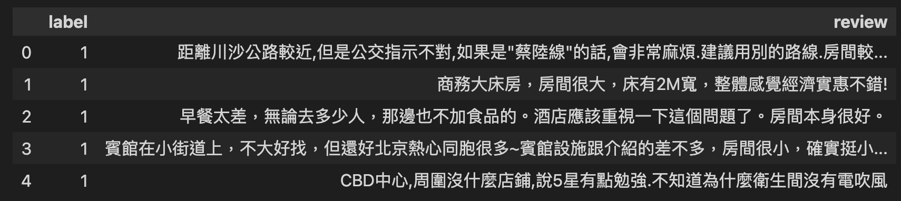

# 透過文件,截入DataSet
- csv載入資料
- load_dataset()功能非常多,可載入huggingface的Dataset,csv,json

```python
from datasets import load_dataset

datasets = load_dataset("csv",data_files='ChnSentiCorp_htl_all.csv')
datasets

#==output==
DatasetDict({
    train: Dataset({
        features: ['label', 'review'],
        num_rows: 7766
    })
})
```

**使用引數名稱split**

```python
from datasets import load_dataset

datasets = load_dataset("csv",data_files='ChnSentiCorp_htl_all.csv',split='train')
datasets

#==output==
Dataset({
    features: ['label', 'review'],
    num_rows: 7766
})
```

**使用Dataset的staticmethod**

```python
from datasets import Dataset

datasets = Dataset.from_csv('ChnSentiCorp_htl_all.csv')
datasets

#==output==
Dataset({
    features: ['label', 'review'],
    num_rows: 7766
})
```


## 載入文件夾內全部文件檔案作為資料集

**使用data_dir**

```python
from datasets import load_dataset

datasets = load_dataset('csv',data_dir="./allData",split="train")
datasets

#==output==
Dataset({
    features: ['label', 'review'],
    num_rows: 23298
})
```

**使用data_files**

```python
from datasets import load_dataset

datasets = load_dataset('csv',data_files=['./allData/data1.csv','./allData/data2.csv'],split="train")
datasets

#==output==
Dataset({
    features: ['label', 'review'],
    num_rows: 15532
})
```


## 將DataFrame轉換為DataSet

```python
import pandas as pd

df = pd.read_csv("ChnSentiCorp_htl_all.csv")
df.head()
```




```python
from datasets import Dataset

dataset = Dataset.from_pandas(df)
dataset

#==output==
Dataset({
    features: ['label', 'review'],
    num_rows: 7766
})
```

## list of Dict轉換為dataset

```python
data = [{"text":"abc"},{"text":"def"}]
Dataset.from_list(data)

#==outpt==
Dataset({
    features: ['text'],
    num_rows: 2
})
```


