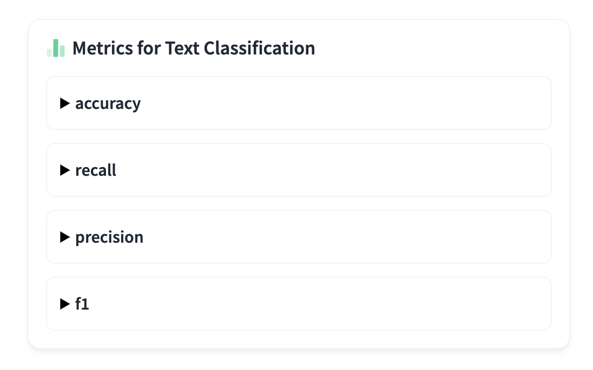

## Evaluate評估

- [task page](https://huggingface.co/tasks)


Evaluate 提供了多種評估工具。它涵蓋了文字、電腦視覺、音訊等一系列模式。

## 安裝

```python
pip install evaluate
```

## 查看任務可以使用的評估函數
- [task page](https://huggingface.co/tasks)




## 查看評估函數說明

## 評估計算
- 最後結果
- 每批次結果


## 複合評估指標


