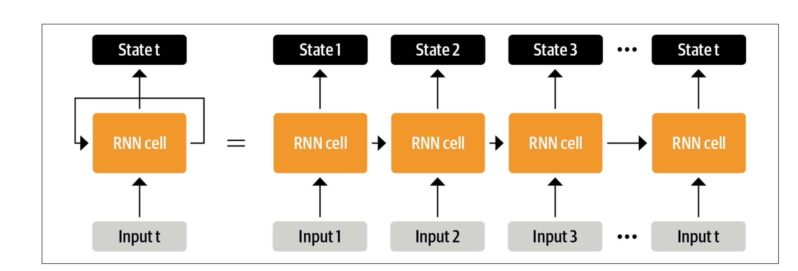
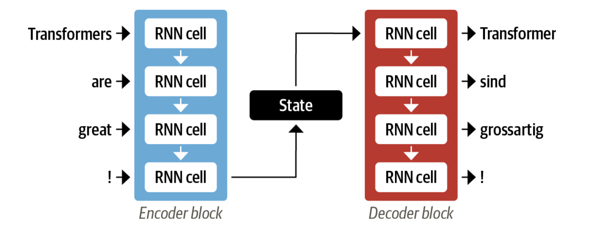
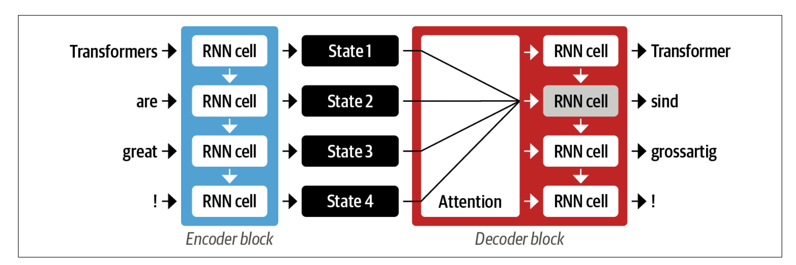
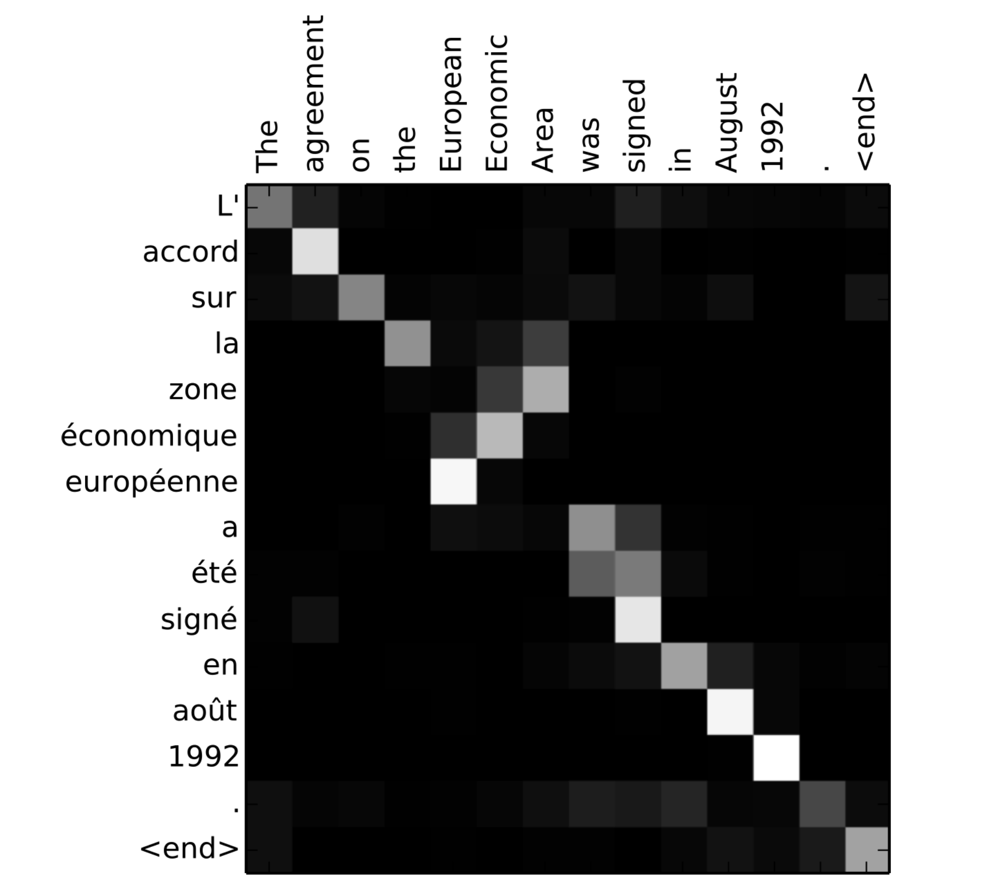
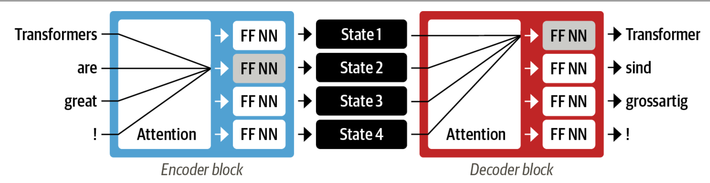

## Model簡介
### Transformer的重要架構
1. The encoder-decoder framework
2. Attention mechanisms
3. Transfer learning

#### The encoder-decoder framework
- 比Transformer興起時就有的架構
在transformer之前，LSTM 等循環架構是 NLP 的最先進技術。這些架構在網路連線中包含一個回饋迴路，可讓資訊從一個步驟傳播到另一個步驟，因此非常適合用來建模文字等序列資料。

一個 RNN 接收一些輸入 (可能是單字或字元)，將其饋入網路，並輸出一個稱為隱藏狀態的向量(**hidden state**)。 與此同時，模型會透過回饋迴路將一些資訊回饋給它自己，然後在下一步中使用這些資訊。如圖所示：RNN 將每一步的狀態資訊傳遞到序列中的下一個操作。這些架構曾經（並將繼續）廣泛應用於 NLP 任務、語音處理和時間序列。RNN 發揮重要作用的一個領域是機器翻譯系統的開發，其目標是將一種語言的字詞序列映射到另一種語言。此類任務通常透過編碼器-解碼器或序列到序列架構，非常適合輸入和輸出都是任意長度序列的情況。編碼器的工作是將輸入序列的資訊編碼成一個數字表示，通常稱為最後的隱藏狀態。

如圖所示:一對 RNN 對此進行了說明，其中英語句子“Transformers are Great!”被編碼為隱藏狀態向量，然後被解碼以產生德語翻譯“Transformer sindgrosartig！”輸入字按順序饋送通過編碼器，並且從上到下一次產生一個輸出字。

儘管這種架構簡單優雅，但其弱點是編碼器的最終隱藏狀態造成了資訊瓶頸(_**information bottleneck**_)：它必須代表整個輸入序列的意義，因為這是解碼器在產生輸出時所能存取的全部資訊。這對於長序列來說尤其具有挑戰性，因為在將所有內容壓縮為單一固定表示法的過程中，序列開頭的資訊可能會遺失。

幸運的是，有一種方法可以擺脫這個瓶頸，即允許解碼器存取所有編碼器隱藏狀態。這一般的機制稱為注意力(_**attention**_)，是許多現代神經網路架構的關鍵元件。了解 RNN 的注意力是如何開發出來的，將有助於我們了解 Transformer 架構的主要構成元素之一。

#### Attention機制
**attention機縐**背後的主要想法是，編碼器不是將輸入序列資料產生單一個的隱藏狀態，而是在每一步驟輸出一個隱藏狀態，讓解碼器可以存取。然而，同時使用所有的狀態會對解碼器造成龐大的輸入，因此需要一些機制來決定使用狀態的優先順序。這就是注意力的作用：它讓解碼器在每個解碼時間步驟為每個編碼器狀態分配不同的權重，或稱「注意力」。

這個過程如圖所示，其中顯示了注意力在預測輸出序列中的第三個標記中的作用。透過在每個時間步驟中專注於哪些輸入標記是最相關的，這些基於注意力的模型能夠學習生成翻譯中的字詞與來源句子中的字詞之間的非三維對齊。

儘管注意力能夠產生更好的翻譯，但使用編碼器和解碼器的循環模型仍然存在一個主要缺點：計算本質上是順序的，不能在輸入序列上並行化。有了轉換器之後，我們就引進了一個新的建模範例：完全捨棄重複性，取而代之的是完全仰賴一種特殊形式的注意力，稱為自我注意（self-attention）。

基本想法是讓注意力作用於神經網路同一層的所有狀態。
其中編碼器和解碼器都有自己的自註意力機制，其輸出被饋送到前饋神經網路（FF NN）。這種架構的訓練速度比循環模型快得多並為 NLP 領域最近的許多突破鋪平了道路。在最初的 Transformer 論文中，翻譯模型是在各種語言的大型句子對語料庫上從頭開始訓練的。然而，在 NLP 的許多實際應用中，我們無法存取大量的標籤文字資料來訓練我們的模型。要開始變壓器革命，還差最後一塊：轉移學習。

#### NLP中的遷移學習

如今，電腦視覺領域的常見做法是使用遷移學習在一項任務上訓練 ResNet 等卷積神經網絡，然後使其適應或微調新任務。這使得網路能夠利用從原始任務中學到的知識。從架構上講，這涉及將模型分割成一個body和一個head，其中head是一個特定於任務的網路。在訓練期間，本體的權重會學習來源領域的廣泛特徵，這些權重會用來初始化新任務的新模型。

