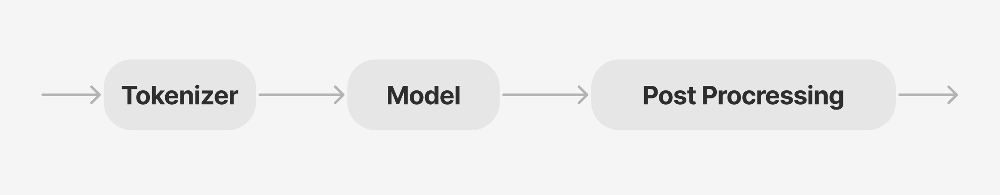

## pipeline

## pipeline [ipynb說明](./pipeline.ipynb)

### 什麼是pipeline
Transformer pipeline 是 Hugging Face Transformers 函式庫所提供的高階抽象類別，其設計目的在於簡化使用預先訓練模型的流程的自然語言處理 (NLP) 任務。



#### 下是其主要元件與功能的概述：
轉換器管道是一個物件，它封裝了模型載入、預處理和後處理的複雜性，讓使用者可以執行下列任務：
1. Text Classification(sentiment analysis) - 內容分類 (例如情感分析)
2. Name Entity Recognition - 命名實體辨識 (NER)
3. Question Answering 問題回答
4. Text Generation 文字產生
5. Translation 翻譯
6. Summarization 總結

這些管道提供了一個簡單的 API，可以抽象化底層程式碼，使用戶可以更輕鬆地實現機器學習模型，而無需深入學習或 NLP 方面的廣泛背景知識.

### 主要特色
1. **特定任務管道**： 每個管道都是針對特定任務量身打造。例如
	- `pipeline("sentiment-analysis")` 用於情感分類
	- `pipeline("question-answering")` 用於從文本中提取出答案

2. **模型(Model)和分詞器(Tokenizer)整合**：使用者可以在建立管道時指定模型和分詞器，從而允許根據特定要求或資料集進行自訂。例如：

```
from transformers import pipeline, AutoModelForTokenClassification, AutoTokenizer

model = AutoModelForTokenClassification.from_pretrained("dbmdz/bert-large-cased-finetuned-conll03-english")
tokenizer = AutoTokenizer.from_pretrained("bert-base-cased")
ner_pipeline = pipeline('ner', model=model, tokenizer=tokenizer)
```

3. **批次處理**:管道支援批次處理，在處理大型資料集時可以顯著提高效能。此功能允許使用者同時處理多個輸入

### 使用範例

```
from transformers import pipeline

# Create a sentiment analysis pipeline
sentiment_pipeline = pipeline("sentiment-analysis")

# Analyze sentiment
result = sentiment_pipeline("I love using Hugging Face Transformers!")
print(result)  # Output might indicate positive sentiment
```

