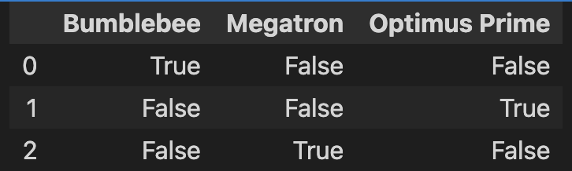

# 將文字轉為Tokens
(From Text to Tokens)

DistilBERT 等 Transformer 模型無法接收原始字串作為輸入；相反，他們假設文本已被`分詞(tokenized)`並`編碼(encoded)`為數字向量(numerical vectors)。
分詞化是將字串分解為模型中使用的最小單元的過程。人們可以採用多種標記化策略，並且通常是從語料庫中學習將單字最佳地拆分為子單元。在了解 DistilBERT 所使用的標記器之前，讓我們先考慮兩種極端情況：字元和單字分詞器。

## 字元分詞器(Character Tokenization)

最簡單的標記化方案是將每個字元單獨提供給模型。

```python
text = 'Tokenizing text is a core task of NLP'
tokenized_text = list(text)
print(tokenized_text)

#==output==
['T', 'o', 'k', 'e', 'n', 'i', 'z', 'i', 'n', 'g', ' ', 't', 'e', 'x', 't', ' ', 'i', 's', ' ', 'a', ' ', 'c', 'o', 'r', 'e', ' ', 't', 'a', 's', 'k', ' ', 'o', 'f', ' ', 'N', 'L', 'P']
```

**將字元轉換為整數(numericalization)**
- 每一個字元有自已的token

```python
token2idx = {ch:idx for idx,ch in enumerate(sorted(set(tokenized_text)))}
print(token2idx)

#==output==
{' ': 0, 'L': 1, 'N': 2, 'P': 3, 'T': 4, 'a': 5, 'c': 6, 'e': 7, 'f': 8, 'g': 9, 'i': 10, 'k': 11, 'n': 12, 'o': 13, 'r': 14, 's': 15, 't': 16, 'x': 17, 'z': 18}
```

**將本文轉換為一串數字**

```python
input_ids = [token2idx[token] for token in tokenized_text]
print(input_ids)

#==output==
[4, 13, 11, 7, 12, 10, 18, 10, 12, 9, 0, 16, 7, 17, 16, 0, 10, 15, 0, 5, 0, 6, 13, 14, 7, 0, 16, 5, 15, 11, 0, 13, 8, 0, 2, 1, 3]
```

最後一步是將 input_ids 轉換為獨熱向量的二維張量。機器學習中經常使用one-hot向量來編碼分類數據。這些數據可以是序數的，也可以是名目的。例如，假設我們想要對《變形金剛》電視劇中角色的名字進行編碼。其中一個方法是將每個名稱對應到一個唯一的 ID，如下所示：

```
import pandas as pd

categorical_df = pd.DataFrame({"Name":["Bumblebee", "Optimus Prime", "Megatron"], "Label ID":[0, 1, 2]})
categorical_df
```


這種方法的問題在於它在名稱之間創造了一種虛構的順序，神經網路非常擅長學習關係類別的表格。
因此，我們可以為每個類別建立一個新列，當類別為真時分配 1，否則分配 0。在 Pandas 中，這可以透過以下方式實現 get_dummies()函數如下：

```python
pd.get_dummies(categorical_df["Name"])
```



**轉換input_ids成為張量**

```
import torch
import torch.nn.functional as F

input_ids = torch.tensor(input_ids)
one_hot_encodings = F.one_hot(input_ids, num_classes=len(token2idx))
one_hot_encodings.shape

#==output==
torch.Size([37, 19])
有37個tokens,獨立的字元有19個
```

**以下為從字元轉換為張量**

```
print(f'token:{tokenized_text[0]}')
print(f'Tensor index:{input_ids[0]}')
print(f"One-hot:{one_hot_encodings[0]}")

#==output==
token:T
Tensor index:4
One-hot:tensor([0, 0, 0, 0, 1, 0, 0, 0, 0, 0, 0, 0, 0, 0, 0, 0, 0, 0, 0])
```

雖然標示字元的方式,有助於處理拼字錯誤和罕見詞,但最大的缺點是英文字的語言架構是單字而不是字元,學習應該是要學習單字。因此,字元標記在實際場景中很少使用。取而代之的分詞化步驟時,保留文字的結構.`文字分詞`可以容易達到保留文字的架構

## 文字分詞(Word Tokenization)
使用拆解一串文字成為單一文字,取代拆解文字成為單一字元和映射到一個整數.從一開始透過文字分詞,可以減少訓練過程的繁雜度。
有一種簡單的文字分詞器,使用空格作為分詞的依據。

```python
text = 'Tokenizing text is a core task of NLP'
tokenized = text.split()
print(tokenized)

#==output==

['Tokenizing', 'text', 'is', 'a', 'core', 'task', 'of', 'NLP']
```

從這裡我們可以採取與字元標記器相同的步驟將每個單字對應到一個 ID。然而，我們已經看到這種標記化方案的一個潛在問題：標點符號沒有被考慮，因此 **NLP.** 被視為單一標記。而使用Word tokenization可能會導致參數過大的問題, 因此近年來發展出比較新的 tokenization 演算法，基本上就是 Subword Tokenization 

## (子詞分詞器)Subword Tokenization

Subword Tokenization就是結合了 Character tokenization 和 Word tokenization。首先它保留常用的單字，讓整個 transformer 的權重不會因為單字的總數太大而爆炸。再來還也保留了 Character tokenization 的機制，可以把單字拆分成更小的單元，進而能夠處理罕用字和拼錯的字. 
子詞分詞器（以及詞分詞器）的主要特徵是它是使用混合統計規則和演算法從預訓練語料庫中學習的。(從預訓練模型中取出分詞器)

**自動取得分詞器**

```
from transformers import AutoTokenizer
model_ckpt = 'distilbert-base-uncased'
tokenizer = AutoTokenizer.from_pretrained(model_ckpt)
```

**手動取得分詞器**

```
from transformers import DistilBertTokenizer
model_ckpt = 'distilbert-base-uncased'
distilbert_tokenizer = DistilBertTokenizer.from_pretrained(model_ckpt)
```

**詞字串轉換為ids**

tokenizer將詞字串分割為**input_ids**和**attention_mask**2個欄位

```
from transformers import AutoTokenizer
model_ckpt = 'distilbert-base-uncased'
tokenizer = AutoTokenizer.from_pretrained(model_ckpt)
text = 'Tokenizing text is a core task of NLP'
encoded_text = tokenizer(text)
print(encoded_text)

#==output==
{'input_ids': [101, 19204, 6026, 3793, 2003, 1037, 4563, 4708, 1997, 17953, 2361, 102], 'attention_mask': [1, 1, 1, 1, 1, 1, 1, 1, 1, 1, 1, 1]}
```

**ids轉為分詞的token**
- [CLS]和[SEP],依序代表的是開始和結束
- 所有字串變為小寫
- `tokenizing`和`NLP`被分割為2個token,因為這2個字不是一般的文字。
- **##**的意思是前面分割的不是使用空白字串

```
print(tokenizer.convert_ids_to_tokens(encoded_text['input_ids']))

#==output==
['[CLS]', 'token', '##izing', 'text', 'is', 'a', 'core', 'task', 'of', 'nl', '##p', '[SEP]']
```

**這個tokenizer的詞彙量**

```
tokenizer.vocab_size

#==output==
30522
```

**tokenizer最大的本文字量**

```
tokenizer.model_max_length

#==output==
512
```

**tokenizer產生的欄位名稱**

```
tokenizer.model_input_names

#==output===
['input_ids', 'attention_mask']
```


## 分詞所有的Dataset

```

```


