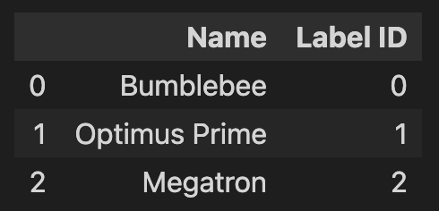

# 將文字轉為Tokens
(From Text to Tokens)

DistilBERT 等 Transformer 模型無法接收原始字串作為輸入；相反，他們假設文本已被`分詞(tokenized)`並`編碼(encoded)`為數字向量(numerical vectors)。
分詞化是將字串分解為模型中使用的最小單元的過程。人們可以採用多種標記化策略，並且通常是從語料庫中學習將單字最佳地拆分為子單元。在了解 DistilBERT 所使用的標記器之前，讓我們先考慮兩種極端情況：字元和單字分詞器。

## 字元分詞器(Character Tokenization)

最簡單的標記化方案是將每個字元單獨提供給模型。

```python
text = 'Tokenizing text is a core task of NLP'
tokenized_text = list(text)
print(tokenized_text)

#==output==
['T', 'o', 'k', 'e', 'n', 'i', 'z', 'i', 'n', 'g', ' ', 't', 'e', 'x', 't', ' ', 'i', 's', ' ', 'a', ' ', 'c', 'o', 'r', 'e', ' ', 't', 'a', 's', 'k', ' ', 'o', 'f', ' ', 'N', 'L', 'P']
```

**將字元轉換為整數(numericalization)**
- 每一個字元有自已的token

```python
token2idx = {ch:idx for idx,ch in enumerate(sorted(set(tokenized_text)))}
print(token2idx)

#==output==
{' ': 0, 'L': 1, 'N': 2, 'P': 3, 'T': 4, 'a': 5, 'c': 6, 'e': 7, 'f': 8, 'g': 9, 'i': 10, 'k': 11, 'n': 12, 'o': 13, 'r': 14, 's': 15, 't': 16, 'x': 17, 'z': 18}
```

**將本文轉換為一串數字**

```python
input_ids = [token2idx[token] for token in tokenized_text]
print(input_ids)

#==output==
[4, 13, 11, 7, 12, 10, 18, 10, 12, 9, 0, 16, 7, 17, 16, 0, 10, 15, 0, 5, 0, 6, 13, 14, 7, 0, 16, 5, 15, 11, 0, 13, 8, 0, 2, 1, 3]
```

最後一步是將 input_ids 轉換為獨熱向量的二維張量。機器學習中經常使用one-hot向量來編碼分類數據。這些數據可以是序數的，也可以是名目的。例如，假設我們想要對《變形金剛》電視劇中角色的名字進行編碼。其中一個方法是將每個名稱對應到一個唯一的 ID，如下所示：

```
import pandas as pd

categorical_df = pd.DataFrame({"Name":["Bumblebee", "Optimus Prime", "Megatron"], "Label ID":[0, 1, 2]})
categorical_df
```




