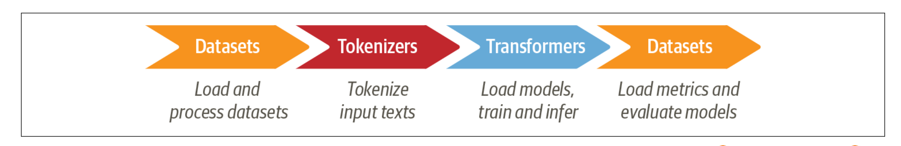

## 文本分類(Text Classification)

文本分類是自然語言中最常使用一種任務。它可以廣泛應用在應用程式中,例如將客戶的回覆資料做分類,或依據使用者使用的語言分類,找到對應的客服人員。

您的電子郵件程式的垃圾郵件過濾器使用文字分類來保護您的收件匣免受大量垃圾郵件的侵擾。

另一種文本分類是情緒分析。想像建立一個應用程式,這可以自動識別使用者在line上回應的內容,使用者的心情狀態如`生氣`或`喜悅`。現在想像一下，你是一名資料科學家，需要建立一個系統，可以自動識別人們在 Twitter 上對你公司的產品表達的情緒狀態，例如「憤怒」或「喜悅」。這個任務會使用到一個`BERT`的變形體,DistiBERT.主要的優點是接近BERT的能力,但模型會變小和不用使用太多記憶體資源(efficient效率),這樣可以使我們訓練只要幾分鐘。


會使用到Hugging Faceing的3個核心庫

- Datasets
- Tokenizer
- Transformers



### DataSet
### 使用hugging face DataSet提供的emotion的[資料集](https://huggingface.co/datasets/dair-ai/emotion)

- 透過hugging facea網站介面了解資料集(適合的任務,筆數,欄位,支援的語言,大小)
- 透過程式碼了解資料[Dataset說明書](https://huggingface.co/docs/datasets/index)

#### 1. 從hugginface載入資料庫

**檢查載入資訊**
- 檢查dataset的資訊
- 不會下載dataset

```python
from datasets import load_dataset_builder

ds_builder = load_dataset_builder("emotion")

#Inspect dataset description
ds_builder.info.description
```


```
#Inspect dataset features
ds_builder.info.features

#==output===
{'text': Value(dtype='string', id=None),
 'label': ClassLabel(names=['sadness', 'joy', 'love', 'anger', 'fear', 'surprise'], id=None)}
 
#說明
- 有text和label 2個欄位
- text是字串
- label->有6種label:sadness,joy,love,anger,fear,surprise
```

**載入資料**
**實際下載資料**
- 會自動儲存至(~/.cache/huggingface)

```python
from datasets import load_dataset

emotions = load_dataset('emotion')
emotions

#==output==

DatasetDict({
    train: Dataset({
        features: ['text', 'label'],
        num_rows: 16000
    })
    validation: Dataset({
        features: ['text', 'label'],
        num_rows: 2000
    })
    test: Dataset({
        features: ['text', 'label'],
        num_rows: 2000
    })
})

說明:
資料被分割為3個部份
train:有16000筆
validation:有2000筆
test:有2000筆
```

**取得切割資料**

```python
```


