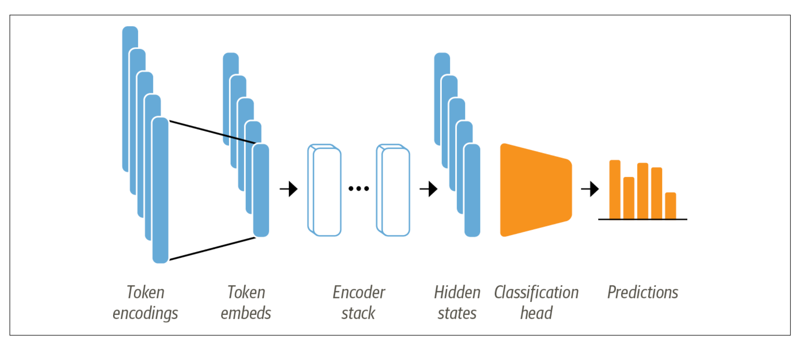
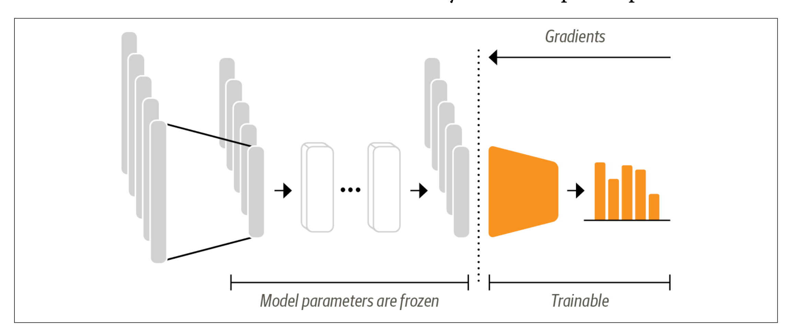

# 訓練文字分類
(Training a Text Classifier)

DistilBERT 等模型經過預先訓練，可以預測文字序列中的遮罩字。但是，我們不能直接使用這些語言模型進行文字分類；我們需要對它們稍加修改。為了了解需要進行哪些修改，讓我們來看看 DistilBERT 等基於編碼器的模型的架構。



文字被標記化並表示為獨熱向量（稱為標記編碼）, 標記器詞彙表的大小決定了標記編碼的維度，它通常由 20k-200k 個唯一標記組成。接下來，這些標記編碼被轉換為標記嵌入，即存在於低維空間中的向量。然後，標記嵌入透過編碼器區塊層來產生每個輸入標記的隱藏狀態。對於語言建模的預訓練目標，每個隱藏狀態都被饋送到預測遮罩輸入標記的層。對於分類任務，我們用分類層取代語言建模層。

**2種方式訓練此模型**

**1.特徵提取(Feature extraction)**

我們使用隱藏狀態作為特徵並在其上訓練分類器，而不修改預訓練模型。

**2.微調(Fine-tuning)**

我們對整個模型進行端到端的訓練，同時也更新了預訓練模型的參數。

## 使用特微提取
使用transformer作為特徵提取器相當簡單,如下圖所示。我們在訓練過程中凍結身體的體重，並使用隱藏狀態作為分類器。



### 使用預訓練模型
我們將使用 Transformers 中另一個方便的自動類，名為 AutoModel。讓我們使用此方法來載入DistilBERT checkpoint：

```python

```


