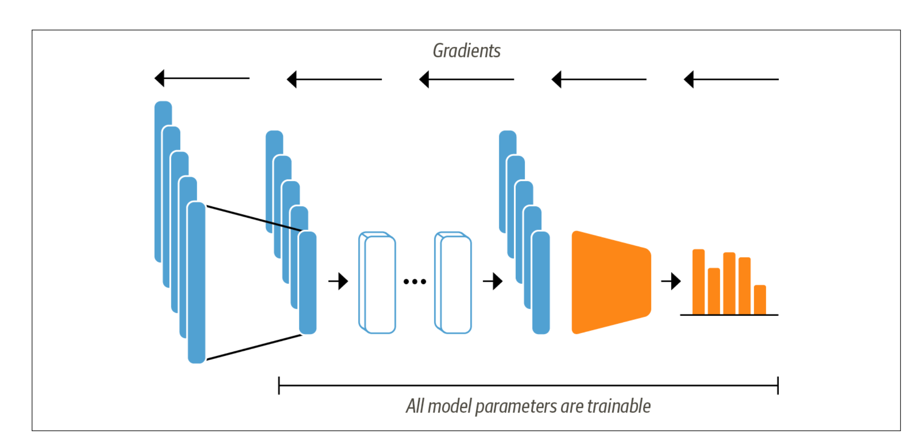

# 訓練文字分類
(Training a Text Classifier)

DistilBERT 等模型經過預先訓練，可以預測文字序列中的遮罩字。但是，我們不能直接使用這些語言模型進行文字分類；我們需要對它們稍加修改。為了了解需要進行哪些修改，讓我們來看看 DistilBERT 等基於編碼器的模型的架構。


文字被標記化並表示為獨熱向量（稱為標記編碼）, 標記器詞彙表的大小決定了標記編碼的維度，它通常由 20k-200k 個唯一標記組成。接下來，這些標記編碼被轉換為標記嵌入，即存在於低維空間中的向量。然後，標記嵌入透過編碼器區塊層來產生每個輸入標記的隱藏狀態。對於語言建模的預訓練目標，每個隱藏狀態都被饋送到預測遮罩輸入標記的層。對於分類任務，我們用分類層取代語言建模層。

**2種方式訓練此模型**

**1.特徵提取(Feature extraction)**

我們使用隱藏狀態作為特徵並在其上訓練分類器，而不修改預訓練模型。

**2.微調(Fine-tuning)**

我們對整個模型進行端到端的訓練，同時也更新了預訓練模型的參數。

## 使用特微提取
使用transformer作為特徵提取器相當簡單,如下圖所示。我們在訓練過程中凍結身體的體重，並使用隱藏狀態作為分類器。


### 使用預訓練模型
我們將使用 Transformers 中另一個方便的自動類，名為 AutoModel。讓我們使用此方法來載入DistilBERT checkpoint：

```python
from transformers import AutoModel
import torch

model_ckpt = 'distilbert-base-uncased'
device = torch.device('cuda' if torch.cuda.is_available() else "cpu")
model = AutoModel.from_pretrained(model_ckpt).to(device)
```

**提取最後的隱藏狀態(Extracting the last hidden states)**

這裡我們使用 PyTorch 來檢查 GPU 是否可用，然後將 PyTorch nn.Module.to() 方法連結到模型載入器。這確保了模型將在 GPU 上運行（如果我們有的話）。如果不是，模型將在 CPU 上運行，這會慢得多。

AutoModel 類別將標記編碼轉換為嵌入，然後將它們輸入編碼器堆疊以傳回隱藏狀態。

為了熱身，讓我們檢索單一字串的最後隱藏狀態。我們需要做的第一件事是對字串進行編碼，並將標記轉換為 PyTorch 張量。這可以透過向標記器提供 return_tensors="pt" 參數來實現，如下所示：

```python
from transformers import AutoTokenizer
model_ckpt = 'distilbert-base-uncased'
tokenizer = AutoTokenizer.from_pretrained(model_ckpt)
```

```
text = 'this is a test'
inputs = tokenizer(text, return_tensors="pt")
print(f"Input tensor shape:{inputs['input_ids'].size()}")

#==output==
Input tensor shape:torch.Size([1, 6])

```

我們可以看到，得到的張量形狀為 [batch_size, n_tokens]. 現在我們已經將編碼作為張量，最後一步是將它們放在與模型相同的裝置上並傳遞輸入，如下所示：

```
inputs = {k:v.to(device)for k, v in inputs.items()}
inputs

#==output==
{'input_ids': tensor([[ 101, 2023, 2003, 1037, 3231,  102]]),
 'attention_mask': tensor([[1, 1, 1, 1, 1, 1]])}
```

```
with torch.no_grad():
    outputs = model(**inputs)
print(outputs)

#==output==
BaseModelOutput(last_hidden_state=tensor([[[-0.1565, -0.1862,  0.0528,  ..., -0.1188,  0.0662,  0.5470],
         [-0.3575, -0.6484, -0.0618,  ..., -0.3040,  0.3508,  0.5221],
         [-0.2772, -0.4459,  0.1818,  ..., -0.0948, -0.0076,  0.9958],
         [-0.2841, -0.3917,  0.3753,  ..., -0.2151, -0.1173,  1.0526],
         [ 0.2661, -0.5094, -0.3180,  ..., -0.4203,  0.0144, -0.2149],
         [ 0.9441,  0.0112, -0.4714,  ...,  0.1439, -0.7288, -0.1619]]]), hidden_states=None, attentions=None)
```

這裡我們使用了 torch.no_grad() 上下文管理器來停用梯度的自動計算。這對於推理很有用，因為它減少了記憶體佔用。列印計算結果。根據模型配置，輸出可以包含多個對象，例如隱藏狀態、損失或註意力，它們排列在類似於 Python 中的命名元組的類別中。
在我們的範例中，模型輸出是 BaseModelOutput 的一個實例，我們可以簡單地透過名稱存取其屬性。當前模型僅傳回一個屬性，即最後一個隱藏狀態，因此讓我們檢查一下它的形狀：

```
outputs.last_hidden_state.size()

#==output==
torch.Size([1, 6, 768])
```

看看隱藏狀態張量，我們發現它的形狀為 [batch_size,n_tokens, hidden_​​dim]。換句話說，傳回一個 768 維向量6個輸入標記中的每一個。對於分類任務，通常做法是只使用與 [CLS] 標記相關的隱藏狀態作為輸入特徵。

```
outputs.last_hidden_state[:,0].size()

#==output==
torch.Size([1, 768])
```

我們知道如何獲取單一字串的最後一個隱藏狀態, 讓我們透過建立一個儲存所有這些向量的新 hidden_​​state 列來對整個資料集執行相同的操作。正如我們對標記器所做的那樣，我們將使用 DatasetDict 的 map() 方法一次提取所有隱藏狀態。我們需要做的第一件事是將前面的步驟包裝在一個處理函數中：

```python
from datasets import load_dataset
from transformers import AutoTokenizer
emotions = load_dataset("emotion")
model_ckpt = "distilbert-base-uncased"
tokenizer = AutoTokenizer.from_pretrained(model_ckpt)
def tokenize(batch):
    return tokenizer(batch['text'], padding=True, truncation=True)

def extract_hidden_states(batch):
    inputs = {k:v.to(device) for k,v in batch.items() if k in tokenizer.model_input_names}
    with torch.no_grad():
        last_hidden_state = model(**inputs).last_hidden_state
    return {"hidden_state": last_hidden_state[:,0].cpu().numpy()}

emotions_encoded = emotions.map(tokenize, batched=True, batch_size=None)
emotions_encoded.set_format("torch", columns=["input_ids", "attention_mask", "label"])
emotions_hidden = emotions_encoded.map(extract_hidden_states, batched=True)
emotions_hidden["train"].column_names

#==output==
['attention_mask', 'hidden_state', 'input_ids', 'label', 'text']
```

```
import numpy as np

X_train = np.array(emotions_hidden['train']['hidden_state'])
X_valid = np.array(emotions_hidden['validation']['hidden_state'])
y_train = np.array(emotions_hidden['train']['label'])
y_valid = np.array(emotions_hidden['validation']['label'])

X_train.shape, X_valid.shape
```

**尚未結束**

### Fine-Tuning Transformer
透過微調方法，我們不將隱藏狀態用作固定特徵,而是訓練它們(如下圖)



這需要分類頭是可微分的，這就是為什麼這種方法通常使用神經網路進行分類。訓練作為分類模型輸入的隱藏狀態，可以幫助我們避免處理可能不太適合分類任務的資料的問題。相反，初始隱藏狀態會在訓練過程中適應，以減少模型損失，從而提高其效能。

**載入預訓練模型**

我們首先需要一個預先訓練的 DistilBERT 模型，就像我們在基於特徵的方法中所使用的模型一樣。唯一的一點修改是我們使用 AutoModelForSequenceClassification 模型而不是 AutoModel。不同之處在於AutoModelForSequenceClassification 模型在
預訓練模型輸出，可以使用基礎模型輕鬆進行訓練。我們只需要指定模型需要預測多少個標籤（在我們的例子中是六個），因為這決定了分類頭的輸出數量：

```python
from transformers import AutoModelForSequenceClassification
import torch

num_labels = 6
model_ckpt = 'distilbert-base-uncased'
device = torch.device('cuda' if torch.cuda.is_available() else "cpu")
model = AutoModelForSequenceClassification.from_pretrained(model_ckpt,num_labels=num_labels).to(device)
```

您將看到一條警告，提示模型的某些部分是隨機初始化的。這是正常的，因為分類主管尚未接受訓練。下一步是定義我們在微調過程中用來評估模型表現的指標。

**定義績效指標**

為了在訓練期間監控指標，我們需要為訓練器定義一個 compute_metrics() 函數。此函數接收一個 EvalPrediction 物件（它是一個命名的具有predictions和 label_ids 屬性的元組）並需要傳回一個將每個指標的名稱對應到其值的字典。對於我們的應用，我們將按如下方式計算 F1 分數和模型的準確率.[說明accuracy_score和f1_score](./score.md)

```
from sklearn.metrics import accuracy_score, f1_score

def compute_metrics(pred):
    labels = pred.label_ids
    preds = pred.predictions.argmax(-1)
    f1 = f1_score(labels, preds)
    acc = accuracy_score(labels, preds)
    return {"accuracy":acc, "f1":f1}
```

資料集和指標準備好後，在定義 Trainer 類別之前，我們只需處理兩件最後的事情：

1. 登入我們在 Hugging Face Hub 上的帳號。這將使我們能夠將經過微調的模型推送到 Hub 上的帳戶並與社群分享。
2. 定義訓練運行的所有超參數。

**訓練模型**

如果您在 Jupyter 筆記本中執行此程式碼，則可以使用下列輔助函數登入 Hub：

```
from huggingface_hub import notebook_login
notebook_login()
```

這將顯示一個小部件，您可以在其中輸入您的使用者名稱和密碼，或具有寫入權限的存取權杖。您可以在 Hub 文件中找到有關如何建立存取權杖的詳細資訊。如果您在終端機中工作，則可以透過執行以下命令登入：

```
$ huggingface-cli login
```

為了定義訓練參數，我們使用 TrainingArguments 類別。這個類別儲存了大量的資訊並讓你可以對訓練和評估進行細粒度的控制。要指定的最重要的參數是 output_dir，它是儲存訓練的所有工件的地方。以下是 TrainingArguments 的範例

- [TrainingArguments所有參數的說明](./training_arguments.md)

```
from transformers import Trainer, TrainingArguments

batch_size = 64
logging_steps = len(emotions_encoded['train']) //batch_size
model_name = f'{model_ckpt}-finetuned-emotion'
traingin_args = TrainingArguments(
    output_dir=model_name,
    num_train_epochs=2,
    learning_rate=2e-5,
    per_device_train_batch_size=batch_size,
    per_device_eval_batch_size=batch_size,
    weight_decay=0.01,
    evaluation_strategy="epoch",
    disable_tqdm=False,
    logging_steps=logging_steps,
    push_to_hub=True,
    log_level="error"
)
```


