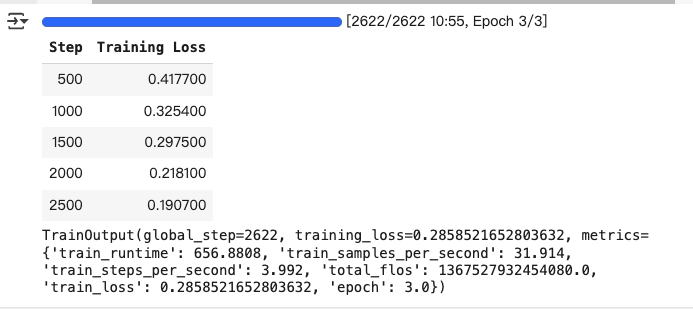
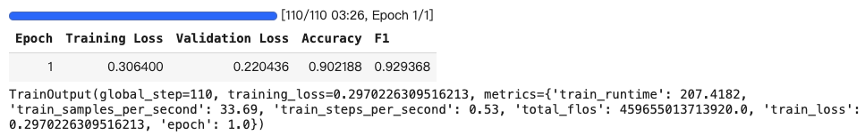
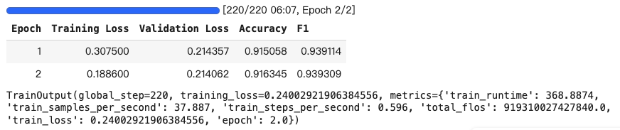

# Trainer和TrainingArguments訓練器
- Trainer class 提供支援PyTorch完整的訓練函數
- Trainer必需配合TrainingArguments
- 會產生評估邏輯

## Trainer的使用限制

- 模型必需回傳tuples或ModelOutput的子類別

- 提供了labels參數，則模型可以計算loss，並且該loss會作為tuple的第一個元素返回（如果您的模型傳回tuple）
- 您的模型可以接受多個標籤參數（在TrainingArguments 中使用 label_names 來向 Trainer 指示它們的名稱），但它們都不應以 「label」 命名。

## 實作
### 前半部-準備資料

```python
from datasets import load_dataset
#載入資料集
dataset = load_dataset("csv",data_files="./ChnSentiCorp_htl_all.csv",split="train")
dataset

#==output==
Dataset({
    features: ['label', 'review'],
    num_rows: 7766
})
```

```python
#清理資料
cleared_dataset = dataset.filter(lambda item: item["review"] is not None)
cleared_dataset

#==output==
Dataset({
    features: ['label', 'review'],
    num_rows: 7765
})
```

```python
#折分資料集
datasets = cleared_dataset.train_test_split(test_size=0.1)
datasets

#==output==
DatasetDict({
    train: Dataset({
        features: ['label', 'review'],
        num_rows: 6988
    })
    test: Dataset({
        features: ['label', 'review'],
        num_rows: 777
    })
})
```

```python
#分詞
from transformers import AutoTokenizer
tokenizer = AutoTokenizer.from_pretrained("google-bert/bert-base-chinese")
def tokenize_function(item):
    '''
    只要先分詞,不要現在轉成tensor,也不用padding,轉成tensor和自動padding,由DataCollator來作
    '''
    tokenized:dict = tokenizer(item['review'],max_length=128,truncation=True)
    tokenized['label'] = item['label']
    return tokenized

tokenized_datasets = datasets.map(function=tokenize_function,
                                  remove_columns=cleared_dataset.column_names)
tokenized_datasets

#==output==
DatasetDict({
    train: Dataset({
        features: ['label', 'input_ids', 'token_type_ids', 'attention_mask'],
        num_rows: 6988
    })
    test: Dataset({
        features: ['label', 'input_ids', 'token_type_ids', 'attention_mask'],
        num_rows: 777
    })
})
```

```python
from transformers import DataCollatorWithPadding
data_collator = DataCollatorWithPadding(tokenizer=tokenizer,return_tensors="pt")
```


```python
#使用Trainer不需要使用DataLoader,也不需要優化器,只需要模型和資料集
from transformers import Trainer, TrainingArguments
from transformers import AutoModelForSequenceClassification
model = AutoModelForSequenceClassification.from_pretrained("google-bert/bert-base-chinese")
#trainer會自動將模型放到gpu上,所以不用手動cuda()
```

```python
#建立評估函數
import evaluate
#acc_metric = evaluate.load('accuracy')
#f1_metric = evaluate.load('f1')
acc_metric = evaluate.load('evaluate-main/metrics/accuracy/accuracy.py')
f1_metric = evaluate.load('evaluate-main/metrics/f1/f1.py')
```

```python
#定義評估函數
def eval_metric(eval_predict):
    predictions, labels = eval_predict
    predictions = predictions.argmax(axis=-1)
    acc = acc_metric.compute(predictions=predictions,references=labels)
    f1 = f1_metric.compute(predictions=predictions,references=labels)
    acc.update(f1)
    return acc
```

### 後半部-TrainingArguments,只有output_dir的部份

```python
#建立TrainingArguments
from transformers import TrainingArguments,Trainer
train_args = TrainingArguments(
  output_dir='./checkpoints',
  report_to="none"  # Disable W&B logging,在colab訓練時,要關閉  
)
#目前的TrainingArguments有預設值,可以直接使用
train_args

```

```
#建立Trainer
trainer = Trainer(
    model=model,
    args=train_args,
    train_dataset=tokenized_datasets['train'],
    eval_dataset=tokenized_datasets['test'],
    data_collator=data_collator,
    compute_metrics=eval_metric
)
```

```python
#模型訓練
trainer.train()
```

**colab訓練時間**



```python
#模型評估
trainer.evaluate()

#==output==
{'eval_loss': 0.4363088309764862,
 'eval_accuracy': 0.888030888030888,
 'eval_f1': 0.9176915799432356,
 'eval_runtime': 5.7563,
 'eval_samples_per_second': 134.981,
 'eval_steps_per_second': 17.025,
 'epoch': 3.0}
```


### 後半部-TrainingArguments,自已設定參數

```python
#建立TrainingArguments,多加一些參數
from transformers import TrainingArguments,Trainer
train_args = TrainingArguments(
  output_dir='./checkpoints',
  report_to="none",  # Disable W&B logging,在colab訓練時,要關閉
  per_device_train_batch_size=64, #訓練時每個gpu的batch size
  per_device_eval_batch_size=128, #評估時每個gpu的batch size
  num_train_epochs=1, #訓練的epochs,預設是3
  logging_steps=100, #每100個batch log一次,預設是500
  eval_strategy="epoch", #評估策略,每一趟評估1次,預設是no
  save_strategy="epoch", #儲存策略,每一趟儲存1次,預設是no
  )
#目前的TrainingArguments有預設值,可以直接使用


trainer = Trainer(
    model=model,
    args=train_args,
    train_dataset=tokenized_datasets['train'],
    eval_dataset=tokenized_datasets['test'],
    data_collator=data_collator,
    compute_metrics=eval_metric
)
trainer.train()

```



### 後半部-TrainingArguments,自已設定參數

```python
#建立TrainingArguments,多加一些參數
from transformers import TrainingArguments,Trainer
train_args = TrainingArguments(
  output_dir='./checkpoints',
  report_to="none",  # Disable W&B logging,在colab訓練時,要關閉
  per_device_train_batch_size=64, #訓練時每個gpu的batch size
  per_device_eval_batch_size=128, #評估時每個gpu的batch size
  num_train_epochs=2, #訓練的epochs,預設是3
  logging_steps=100, #每100個batch log一次,預設是500
  eval_strategy="epoch", #評估策略,每一趟評估1次,預設是no
  save_strategy="epoch", #儲存策略,每一趟儲存1次,預設是no
  learning_rate=2e-5, #學習率,預設是5e-5
  weight_decay=0.01, #權重衰減,預設是0.01
  metric_for_best_model="f1", #最佳模型的指標,預設是eval_loss
  greater_is_better=True, #指標是否越大越好,預設是False
  load_best_model_at_end=True, #訓練完後,是否載入最佳模型,預設是False
  )
#目前的TrainingArguments有預設值,可以直接使用


trainer = Trainer(
    model=model,
    args=train_args,
    train_dataset=tokenized_datasets['train'],
    eval_dataset=tokenized_datasets['test'],
    data_collator=data_collator,
    compute_metrics=eval_metric
)
trainer.train()

```



```python
#模型評估
trainer.evaluate()

#==output==
使用第2趟的模型,因為f1是最低的

{'eval_loss': 0.21406234800815582,
 'eval_accuracy': 0.9163449163449163,
 'eval_f1': 0.9393090569561158,
 'eval_runtime': 5.0575,
 'eval_samples_per_second': 153.633,
 'eval_steps_per_second': 1.384,
 'epoch': 2.0}
```


