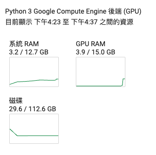
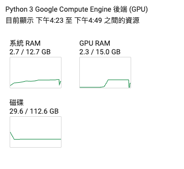
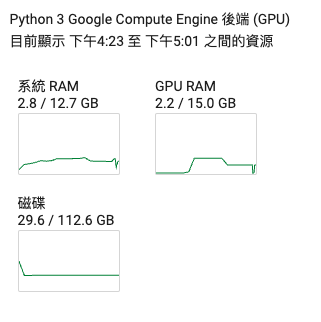
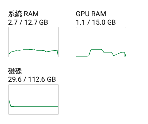
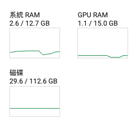

# 動態調整訓練時記憶體使用

## GPU優化策略, 4GB顯示卡記憶體也能跑BERT-Large
### 顯示卡記憶體占用簡單分析
- 模型權重
	- 4Bytes * 模型參數量
- 優化器狀態
	- 8Bytes * 模型參數量,對於常用的AdamW優化器而言
- 梯度
	- 4 Bytes * 模型參數量

- 向前值
	- 取決于序列長度,隱藏維度,Batch大小等多個因數

### 測試
- 環境colab T4GPU
- 使用後面的數據集

**更改參數(使用*符號代表更改)**

- **maxlength=128**
- **per_device_train_batch_size=32**
- **per_device_eval_batch_size=32**

```python
train_args = TrainingArguments(
    output_dir='./checkpoints',
    per_device_train_batch_size=*32,
    per_device_eval_batch_size=*32,
    num_train_epochs=*1,
    logging_steps=10,
    evaluation_strategy="epoch",
    save_strategy="epoch",
    save_total_limit=3,
    learning_rate=2e-5,
    weight_decay=0.01,
    metric_for_best_model='f1',
    load_best_model_at_end=True,
    report_to='none'
)
```

預估時間2分07秒


---

**更改參數(使用*符號代表更改)**
- batch=1, 這樣梯度累加會不好,必需手動改變梯度累加
- **maxlength=128**
- **per_device_train_batch_size=1**
- **per_device_eval_batch_size=1**
- **gradient_accumulation_steps=32**

```python
train_args = TrainingArguments(
    output_dir='./checkpoints',
    per_device_train_batch_size=*1,
    per_device_eval_batch_size=*1,
    gradient_accumulation_steps=*32,
    num_train_epochs=1,
    logging_steps=10,
    evaluation_strategy="epoch",
    save_strategy="epoch",
    save_total_limit=3,
    learning_rate=2e-5,
    weight_decay=0.01,
    metric_for_best_model='f1',
    load_best_model_at_end=True,
    report_to='none'
)
```

預估時間6分20秒



---

**更改參數(使用*符號代表更改)**

- batch=1, 這樣梯度累加會不好,必需手動改變梯度累加

- **maxlength=128**
- **per_device_train_batch_size=1**
- **per_device_eval_batch_size=1**
- **gradient_accumulation_steps=32**
- **gradient_checkpointing=True**

```python
train_args = TrainingArguments(
    output_dir='./checkpoints',
    per_device_train_batch_size=*1,
    per_device_eval_batch_size=*1,
    gradient_accumulation_steps=*32,
    gradient_checkpointing=*True,
    num_train_epochs=1,
    logging_steps=10,
    evaluation_strategy="epoch",
    save_strategy="epoch",
    save_total_limit=3,
    learning_rate=2e-5,
    weight_decay=0.01,
    metric_for_best_model='f1',
    load_best_model_at_end=True,
    report_to='none'
)
```

預估時間6分30秒,時間會一直變動



---

**更改參數(使用*符號代表更改)**

- batch=1, 這樣梯度累加會不好,必需手動改變梯度累加

- **maxlength=128**
- **per_device_train_batch_size=1**
- **per_device_eval_batch_size=1**
- **gradient_accumulation_steps=32**
- **gradient_checkpointing=True**

```python
train_args = TrainingArguments(
    output_dir='./checkpoints',
    per_device_train_batch_size=*1,
    per_device_eval_batch_size=*1,
    gradient_accumulation_steps=*32,
    gradient_checkpointing=*True,
    num_train_epochs=1,
    logging_steps=10,
    evaluation_strategy="epoch",
    save_strategy="epoch",
    save_total_limit=3,
    learning_rate=2e-5,
    weight_decay=0.01,
    metric_for_best_model='f1',
    load_best_model_at_end=True,
    report_to='none'
)
```

預估時間8分,時間會一直變動



---

**更改參數(使用*符號代表更改)**

- batch=1, 這樣梯度累加會不好,必需手動改變梯度累加

- **maxlength=64**
- **per_device_train_batch_size=1**
- **per_device_eval_batch_size=1**
- **gradient_accumulation_steps=32**
- **gradient_checkpointing=True**

```python
train_args = TrainingArguments(
    output_dir='./checkpoints',
    per_device_train_batch_size=*1,
    per_device_eval_batch_size=*1,
    gradient_accumulation_steps=*32,
    gradient_checkpointing=*True,
    num_train_epochs=1,
    logging_steps=10,
    evaluation_strategy="epoch",
    save_strategy="epoch",
    save_total_limit=3,
    learning_rate=2e-5,
    weight_decay=0.01,
    metric_for_best_model='f1',
    load_best_model_at_end=True,
    report_to='none'
)
```

預估時間9分,時間會一直變動



---


**載入數據集資料**

```python
from transformers import AutoTokenizer, AutoModelForSequenceClassification, Trainer, TrainingArguments
from datasets import load_dataset
'''
dataset_dict = load_dataset("csv",data_files="./ChnSentiCorp_htl_all.csv") #split不指定會傳出DatasetDict
dataset_dict['train']
'''
#整合上面2行成為1行的語法
dataset = load_dataset("csv",data_files='./ChnSentiCorp_htl_all.csv', split="train")
dataset
#清理資料
dataset = dataset.filter(lambda example: example['review'] is not None)
dataset

#==output==
Dataset({
    features: ['label', 'review'],
    num_rows: 7765
})
```

**數據集分類**

```python
datasets = dataset.train_test_split(test_size=0.1)
datasets

#==output==
DatasetDict({
    train: Dataset({
        features: ['label', 'review'],
        num_rows: 6988
    })
    test: Dataset({
        features: ['label', 'review'],
        num_rows: 777
    })
})
```

**數據集分詞處理**

```python
tokenizer = AutoTokenizer.from_pretrained('google-bert/bert-base-chinese')

def tokenizer_process(example:dict[str,any]) -> dict[str,any]:
    tokenized_example:dict = tokenizer(example['review'], max_length=128, truncation=True)
    tokenized_example['labels'] = example['label']
    return tokenized_example

tokenized_datasets = datasets.map(tokenizer_process,batched=True,remove_columns=datasets['train'].column_names)
tokenized_datasets

#==output==
DatasetDict({
    train: Dataset({
        features: ['input_ids', 'token_type_ids', 'attention_mask', 'labels'],
        num_rows: 6988
    })
    test: Dataset({
        features: ['input_ids', 'token_type_ids', 'attention_mask', 'labels'],
        num_rows: 777
    })
})
```

**取得預訓練模型**

```python
model = AutoModelForSequenceClassification.from_pretrained('google-bert/bert-base-chinese')
```

**建立評估函數**

```python
import evaluate
#acc_metric = evaluate.load('accuracy')
#f1_metric = evaluate.load('f1')
acc_metric = evaluate.load('evaluate-main/metrics/accuracy/accuracy.py')
f1_metric = evaluate.load('evaluate-main/metrics/f1/f1.py')

def eval_metric(eval_predict):
    predictions, labels = eval_predict
    predictions = predictions.argmax(axis=-1)
    acc = acc_metric.compute(predictions=predictions, references=labels)
    f1 = f1_metric.compute(predictions=predictions, references=labels)
    acc.update(f1)
    return acc

```

**建立TrainingArguments**

```python
train_args = TrainingArguments(
    output_dir='./checkpoints',
    per_device_train_batch_size=64,
    per_device_eval_batch_size=128,
    logging_steps=10,
    evaluation_strategy="epoch",
    save_strategy="epoch",
    save_total_limit=3,
    learning_rate=2e-5,
    weight_decay=0.01,
    metric_for_best_model='f1',
    load_best_model_at_end=True,
    report_to='None',
    num_train_epochs=3 #預設為3
)
```


```python
trainer.train()
```

