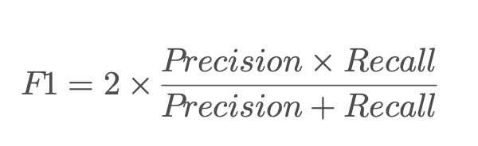

# 評估指標說明
這四個指標（accuracy、recall、precision、F1-score）在 **Token Classification**（例如命名實體識別，NER）任務中的作用如下：

**1. Accuracy（準確率）**

衡量模型整體預測正確的比例。

**計算公式**

• TP（True Positive）：正確預測為正類的數量

• TN（True Negative）：正確預測為負類的數量

• FP（False Positive）：錯誤地將負類預測為正類的數量

• FN（False Negative）：錯誤地將正類預測為負類的數量

**範例**

假設我們有一句話：「台北是台灣的首都」，模型的預測與標註如下：

| **Token** | **Ground Truth (標註)** | **Prediction (預測)** | **評估類別** |
| --------- | --------------------- | ------------------- | -------- |
| 台北        | LOC (地名)              | LOC (地名)            | ✅ TP     |
| 是         | O (無標註)               | O (無標註)             | ✅ TN     |
| 台灣        | LOC (地名)              | O (無標註)             | ❌ FN     |
| 的         | O (無標註)               | O (無標註)             | ✅ TN     |
| 首都        | O (無標註)               | LOC (地名)            | ❌ FP     |

計算：

```
針對的是`評估類別`
正確:3個,錯誤:2個,全部:5個
Accurency = 3 / 5 = 0.6 
```

📌 問題：當類別不均衡時（如大部分標註都是 O），Accuracy 可能會誤導，因為模型只要預測全部為 O 仍然可以獲得高準確率。

**2. Recall（召回率）**

衡量 **所有應該預測為正類的標註**，有多少被正確預測出來。

**關注 FN（漏掉的標註）是否很高。**

**計算公式**

**範例**

• 只有 **台北** 和 **台灣** 是 LOC，但 **台灣** 被錯誤標註為 O（FN）。

• 計算：

```
#針對的是`標註`
`台北`和`台灣`是我們要取得的,但`台灣`錯誤
Recall = 正確數/全部我們要取得的數量 = 1 / 2 = 0.5
```


📌 問題：過度提高 Recall 可能會導致模型標註過多（例如將 O 也標為 LOC），導致 FP 增加。

**3. Precision（精確率）**

衡量 **所有預測為正類的標註**，有多少是正確的。

**關注 FP（多標錯的標註）是否很高。**

**計算公式**

**範例**

• 兩個預測為 LOC 的 token：**台北**（TP）和 **首都**（FP）。

• 計算：

```
#計對的是`預測`,預測正確的有多少個
precision = 預測正確的 / 預測的總數 = 1 / 2 = 0.5
```

📌 問題：過度提高 Precision 可能會讓模型太過保守，寧願不標註（減少 FP），導致 Recall 降低。

**4. F1-score（F1 值）**

**Precision 和 Recall 的加權平均**，用來在 Precision 和 Recall 之間取得平衡。

**計算公式**

**範例**

```
f1 = 2 * (0.25 / 1) = 0.5
```

📌 問題：如果 Precision 和 Recall 差距太大，F1-score 可能仍然不是最佳的評估指標。

**總結**

| **指標**         | **目的**                 | **何時重要？**           |
| -------------- | ---------------------- | ------------------- |
| Accuracy（準確率）  | 整體正確率                  | 當類別平衡時有意義           |
| Recall（召回率）    | 找出所有應該標註的項目            | 不能錯過關鍵標註時（如醫療、欺詐檢測） |
| Precision（精確率） | 預測為正的項目有多少是對的          | 不能標註錯誤時（如法律、金融）     |
| F1-score       | Precision 和 Recall 的平衡 | 需要在兩者之間取得最佳效果時      |

🔗 **進一步閱讀**

• [精確率、召回率和 F1-score 的解釋](https://towardsdatascience.com/accuracy-precision-recall-or-f1-331fb37c5cb9) (英文)

• [Scikit-learn precision_recall_fscore_support](https://scikit-learn.org/stable/modules/generated/sklearn.metrics.precision_recall_fscore_support.html) (官方文件)

這些指標在 **NER、POS 標註、句法分析等 NLP 任務** 都很常見，你可以根據應用場景選擇適合的指標來評估模型表現！
