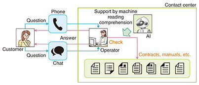

# 什麼是機器閱讀理解?

### Machine Reading Comprehension for Question Answering**

**讓機器讀懂內容、回答問題的技術**

#### **什麼是Question Answering?**
- **定義**：  
  Question Answering (QA) 是一種自然語言處理 (NLP) 任務，讓機器能夠回答人類提出的問題。  
- **QA 的類型**：  
  - **Closed-book QA**：機器靠內部知識回答問題（如預訓練語言模型）。  
  - **Open-book QA**：機器參考外部資源（如文本、網頁）回答問題。  
- **MRC 的定位**：  
  Machine Reading Comprehension (MRC) 是 Open-book QA 的一種，機器從特定的內容中提取答案。

---

#### Machine Reading Comprehension (MRC) 簡介**
- **什麼是 MRC?**  
  MRC 是讓機器閱讀一段內文，並根據問題從中找出答案的技術。  
- **運作方式**：  
  - 輸入：一個問題 + 一段文本。  
  - 輸出：從內容中提取的答案。  
- **目標**：  
  理解文本內容，並精準回答問題。

---

#### **MRC 可以應用在什麼任務上?**
- **應用場景**：  
  - **自動客服**：回答客戶問題，提升效率。  
  - **教育**：解答學生疑問，輔助學習。  
  - **法律**：從法律文件提取答案，幫助律師查找資訊。  
  - **醫療**：從醫療文獻中提取答案，協助醫生決策。  
- **價值**：  
  節省時間、提高準確性，讓資訊更容易被獲取。

---

#### **訓練 MRC 模型要注意什麼?**
- **關鍵注意事項**：  
  1. **數據品質**：  
     - 訓練數據要準確、完整，並貼近應用場景。  
  2. **模型架構**：  
     - 選擇適合的模型，如 BERT、RoBERTa 等。  
  3. **超參數調整**：  
     - 調整學習率、批次量大小等，提升模型效果。  
  4. **評估指標**：  
     - 用 F1-score（準確性與覆蓋率平衡）或 EM-score（完全匹配率）評估模型。  
  5. **避免過度擬合**：  
     - 確保模型在未見數據上也能表現良好。  

---

#### **總結**
- **核心概念**：  
  MRC 是 QA 的一種技術，讓機器從文本中提取答案。  
- **應用廣泛**：  
  可用於客服、教育、法律、醫療等領域。  
- **訓練重點**：  
  注意數據、模型、超參數、評估與過擬合問題。  
- **意義**：  
  MRC 讓機器更聰明，幫助我們更快解決問題！

