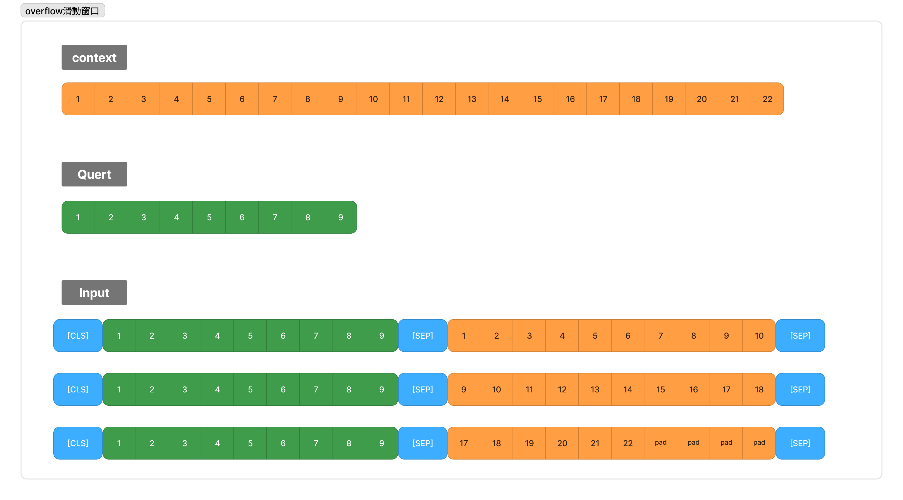

# 基於滑動視窗策略的機器閱讀理解任務實現
> [!TIP]
> [`滑動視窗策略示意圖`說明的jam檔案](./白板)     
> [`滑動視窗策略程式碼邏輯`說明的jam檔案](./白板)    
> [教學用的說明ipynb檔](./教學用.ipynb)  
> [滑動視窗實作的ipynb檔](./qa_train.ipynb)  
> 範例使用資料集(roberthsu2003/for_MRC_QA)   
> 使用模型(google-bert/bert-base-chinese) 
> [下載模型預測](./下載模型實作.ipynb)
 
 

## 評估指標:
- 精准匹配度(Exact Match,EM):計算預測結果與標準答案是否完全匹配。
- 模糊匹配度(F1):計算預測結果與標準答案之間,字數級別的匹配程度。

> [!TIP]
> 下方為簡單範例

```
模型預測結果:台北
真實標籤結果:台北市永和區

計算結果:
EM = 0 #答案不正確
Precision =2/2 # `台北`2字都有包含在`台北市永和區`
Recall = 2/6 # `台北`2字和標準答案的字數的比例
F1 ~= 0.50 

F1的公式是:
(2 * Precision * Recall) / (Precision + Recall)
```

## 數據預處理

### 1. 數據處理格式  



### 2. 如何準確定位答案位置

- start_positions / end_positions
- offset_mapping

### 3. Content過長的解決
- 滑動視窗策略,損失較小,較為複雜


## 策略: 滑動視窗策略的實作

