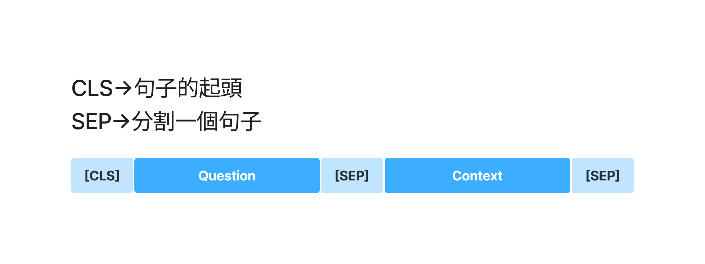

# 基於截斷策略的機器閱讀理解任務實現
> [!TIP]
> [教學用的說明ipynb檔](./教學用.ipynb)  
> [截斷實作的ipynb檔](./qa_train.ipynb)  
> [將DRCD資料轉換為cmrc2018格式](./將DRCD資料轉換為cmrc2018格式.ipynb)  
> 使用模型(google-bert/bert-base-chinese)  
> 範例使用資料集(roberthsu2003/for_MRC_QA)  
> [`截斷策略程式碼邏輯`說明的jam檔案](./白板) 

## 評估指標:
- 精准匹配度(Exact Match,EM):計算預測結果與標準答案是否完全匹配。
- 模糊匹配度(F1):計算預測結果與標準答案之間,字數級別的匹配程度。

> [!TIP]
> 下方為簡單範例  

```
模型預測結果:台北
真實標籤結果:台北市永和區

計算結果:
EM = 0 #答案不正確
Precision =2/2 # `台北`2字都有包含在`台北市永和區`
Recall = 2/6 # `台北`2字和標準答案的字數的比例
F1 ~= 0.50 

F1的公式是:
(2 * Precision * Recall) / (Precision + Recall)
```

## 數據預處理

### 1. 數據處理格式  



### 2. 如何準確定位答案位置

- start_positions / end_positions
- offset_mapping

### 3. Content過長的解決
- 策略:直接截斷, 簡單易於實現, 但是會損失後面的資料


## 策略:直接截斷的實作

### Step1 載入相關套件

- 使用AutoModelForQuestionAnswering
- DefaultDataCollator

```python
from datasets import load_dataset
from transformers import AutoTokenizer, AutoModelForQuestionAnswering, TrainingArguments, Trainer, DefaultDataCollator
```

### Step2 數據集載入

```python
datasets = load_dataset('roberthsu2003/for_MRC_QA', cache_dir='data')
datasets
```

### Step3 數據預處理

```pyton
tokenizer = AutoTokenizer.from_pretrained('google-bert/bert-base-chinese')

def process_func(examples):
    tokenized_examples = tokenizer(text=examples['question'],
                               text_pair=examples['context'],
                               max_length=512,
                               return_offsets_mapping=True,
                               truncation="only_second",
                               padding=True)
    offset_mapping = tokenized_examples.pop("offset_mapping")
    start_positions = []
    end_positions = []
    for idx, offset in enumerate(offset_mapping):
        answer = examples['answers'][idx]
        start_char = answer["answer_start"][0]
        end_char = start_char + len(answer['text'][0])
        context_start = tokenized_examples.sequence_ids(idx).index(1)
        context_end = tokenized_examples.sequence_ids(idx).index(None,context_start) - 1

        if offset[context_end][1] < start_char or offset[context_start][0] > end_char:
            #代表答案不在context中
            start_token_pos = 0
            end_token_pos = 0
        else:
            token_id = context_start
            while token_id <= context_end and offset[token_id][0] < start_char:
                token_id += 1
            start_token_pos = token_id
            token_id = context_end
            while token_id >= context_start and offset[token_id][1] > end_char:
                token_id -= 1
            end_token_pos = token_id
        start_positions.append(start_token_pos)
        end_positions.append(end_token_pos)
    tokenized_examples["start_positions"] = start_positions
    tokenized_examples["end_positions"] = end_positions
    return tokenized_examples
```


```python
tokenied_datasets = datasets.map(process_func, batched=True, remove_columns=datasets['train'].column_names)
```


### Step4 配置模型

```python
model = AutoModelForQuestionAnswering.from_pretrained('google-bert/bert-base-chinese')
```

### Step5 配置TrainingArguments

```python
args = TrainingArguments(
    output_dir = 'models_for_qa_cut', 
    per_device_train_batch_size=32,
    per_device_eval_batch_size=32,
    eval_strategy="epoch",
    save_strategy="epoch",
    logging_steps=50,
    num_train_epochs=3,
    report_to='none'
)
```

## Step6 建立訓練器

```python
trainer = Trainer(
    model=model,
    args=args,
    train_dataset=tokenied_datasets['train'],
    eval_dataset=tokenied_datasets['validation'],
    data_collator=DefaultDataCollator()
)
```

## Step7 訓練

```python
trainer.train()
```

## Step8 測試模型

```python
from transformers import pipeline

pipe = pipeline("question-answering", model=model,tokenizer=tokenizer, device=0)
pipe(question="蔡英文何時卸任?",context="蔡英文於2024年5月卸任中華民國總統，交棒給時任副總統賴清德。卸任後較少公開露面，直至2024年10月她受邀訪問歐洲。[25]")
```

## Step9 上傳模型

```python
from huggingface_hub import login
login()
```

```python
trainer.push_to_hub("roberthsu2003") 
#同時要上傳tokenizer
model_name = "roberthsu2003/models_for_qa_cut"
tokenizer.push_to_hub(model_name)
```
