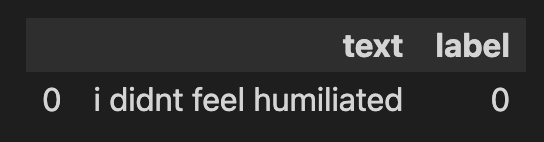
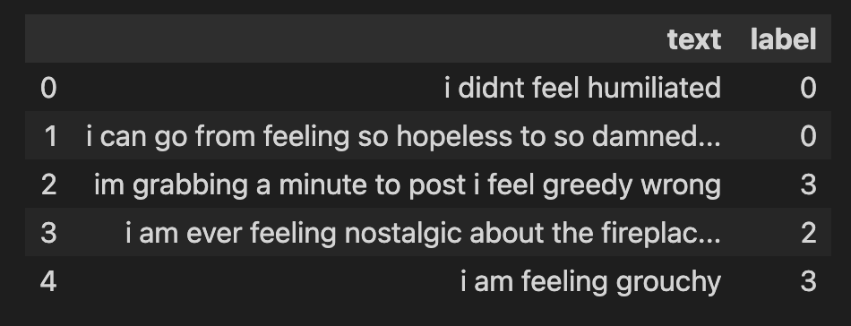
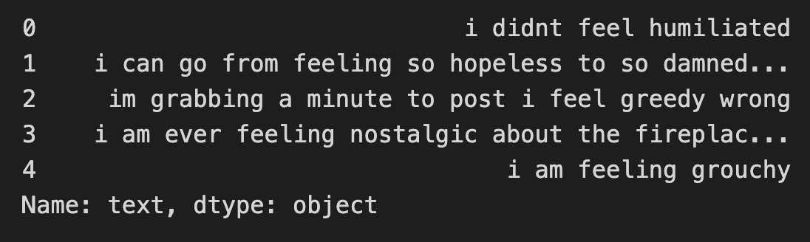
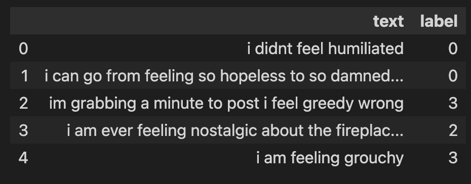
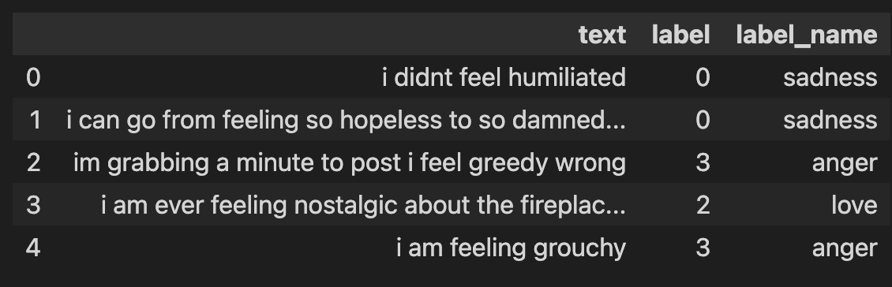
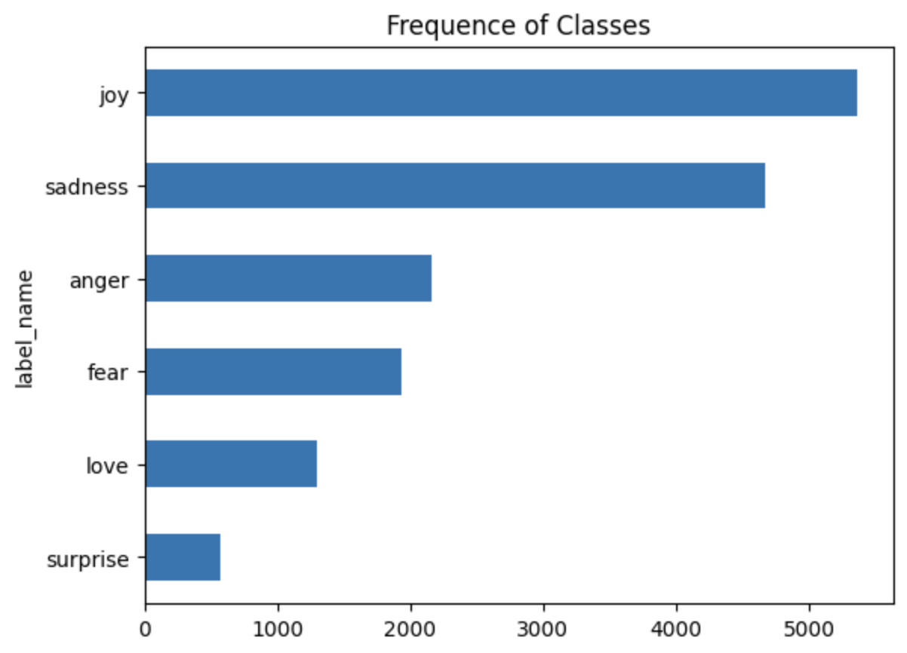
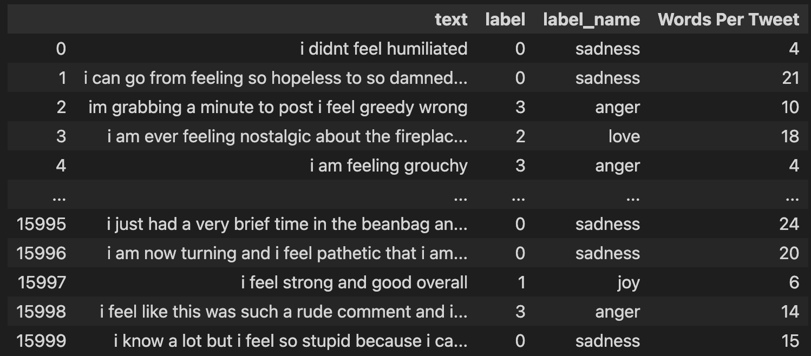
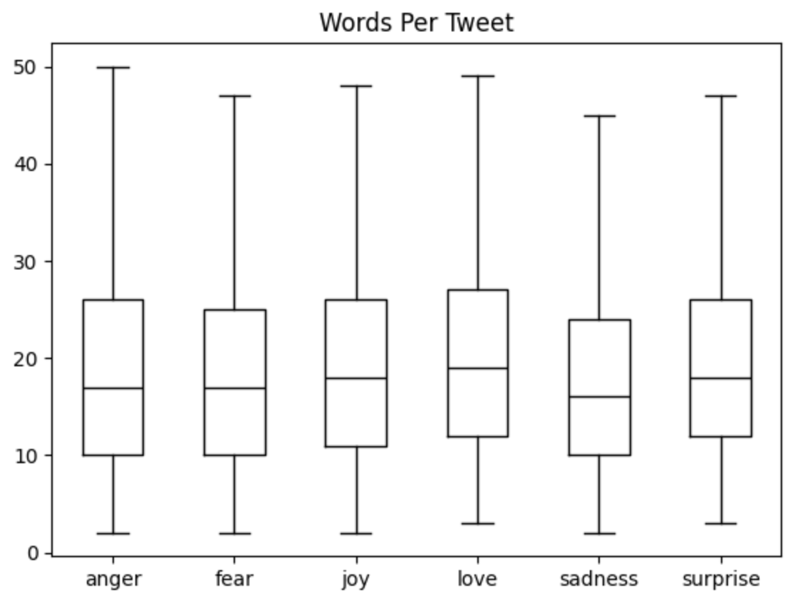

## DataSet
### 使用hugging face DataSet提供的emotion的[資料集](https://huggingface.co/datasets/dair-ai/emotion)

- 透過hugging facea網站介面了解資料集(適合的任務,筆數,欄位,支援的語言,大小)
- 透過程式碼了解資料[Dataset說明書](https://huggingface.co/docs/datasets/index)

### 1. 從hugginface載入資料庫

**檢查載入資訊**
- 檢查dataset的資訊
- 下載dataset,不會儲存

```python
from datasets import load_dataset_builder

ds_builder = load_dataset_builder("emotion")

#Inspect dataset description
ds_builder.info.description
```


```
#Inspect dataset features
ds_builder.info.features

#==output===
{'text': Value(dtype='string', id=None),
 'label': ClassLabel(names=['sadness', 'joy', 'love', 'anger', 'fear', 'surprise'], id=None)}
 
#說明
- 有text和label 2個欄位
- text是字串
- label->有6種label:sadness,joy,love,anger,fear,surprise
```

**載入資料**
**實際下載資料**
- 會自動儲存至(~/.cache/huggingface)

```python
from datasets import load_dataset

emotions = load_dataset('emotion')
emotions

#==output==

DatasetDict({
    train: Dataset({
        features: ['text', 'label'],
        num_rows: 16000
    })
    validation: Dataset({
        features: ['text', 'label'],
        num_rows: 2000
    })
    test: Dataset({
        features: ['text', 'label'],
        num_rows: 2000
    })
})

說明:
資料被分割為3個部份
train:有16000筆
validation:有2000筆
test:有2000筆
```

**取得切割資料(split)**
**方法1**

```python
from datasets import load_dataset
load_dataset('emotion',split="train")

#===output===
Dataset({
    features: ['text', 'label'],
    num_rows: 16000
})
```

**方法2**

- 取得DatasetDict

```python
from datasets import load_dataset

dataset = load_dataset("emotion")
dataset['train']

#===output===
Dataset({
    features: ['text', 'label'],
    num_rows: 16000
})
```

**有結構性的Dataset(configurations)**

有些資料結構包含子資料結構,例如[MInDS-14](https://huggingface.co/datasets/PolyAI/minds14),此dataset有多個子dataset,每一個包含不同的audio和不同的語言。這些子dataset被稱為subsets或configurations

> 注意,可以到Huggingface dataset介面,一般都會有針對此dataset的處理範例


### 2. 分析下載的dataset
**一般分析**
- 數量
- 內容
- 欄位名稱

```python
len(train_ds)

#===output====
數量:16000
```

```python
train_ds[0]

#====output====
取出第一筆資料
```



**取出欄位名稱**

```
train_ds.column_names

#==output==
取出欄位名稱
['text', 'label']
```

**取出特徵**

```
train_ds.features

#==output==
{'text': Value(dtype='string', id=None),
 'label': ClassLabel(names=['sadness', 'joy', 'love', 'anger', 'fear', 'surprise'], id=None)}
```

**取出所有欄位前5筆**

```python
train_ds[:5]
```



**取出文字欄位前5筆**

```python
train_ds['text'][:5]
```



**pandas分析**
- 表格顯示
- 統計
- 圖表

**使用pandas資料結構**
- 新的預設是pandas

```python
import pandas as pd

emotions = load_dataset('emotion')
emotions.set_format(type="pandas")
emotions

#==output==
DatasetDict({
    train: Dataset({
        features: ['text', 'label'],
        num_rows: 16000
    })
    validation: Dataset({
        features: ['text', 'label'],
        num_rows: 2000
    })
    test: Dataset({
        features: ['text', 'label'],
        num_rows: 2000
    })
})
```

**取得的資料,傳出pandas的結構**

```python
df = emotions['train'][:]
df.head()
```



```python
emotions['train']

#==output==
Dataset({
    features: ['text', 'label'],
    num_rows: 16000
})
```


```python
emotions['train'].features

#==output==
{'text': Value(dtype='string', id=None),
 'label': ClassLabel(names=['sadness', 'joy', 'love', 'anger', 'fear', 'surprise'], id=None)}
```

```python
emotions['train'].features['label']

#==output==
ClassLabel(names=['sadness', 'joy', 'love', 'anger', 'fear', 'surprise'], id=None)
```


```python
emotions['train'].features['label'].int2str(0)

#==output==
'sadness'
```

**整合成一個完整表格**

```
def label_int2str(row):
    return emotions['train'].features['label'].int2str(row)

df['label_name'] = df['label'].apply(label_int2str)
df.head()
```



**統計目前所有資料6個類別的數量**


```
df['label_name'].value_counts()

#==output==
label_name
joy         5362
sadness     4666
anger       2159
fear        1937
love        1304
surprise     572
Name: count, dtype: int64
```

**使用圖表表示數量和比率**

```
import matplotlib.pyplot as plt

df['label_name'].value_counts(ascending=True).plot.barh()
plt.title('Frequence of Classes')
plt.show()
```




**文字長度的分析**

因為Transformer模型,有一個參數的最大長度,所以最好可以知道文本的最大長度

```python
df['Words Per Tweet']= df['text'].str.split().apply(len)
df
```



```python
df['Words Per Tweet']= df['text'].str.split().apply(len)
df.boxplot(column='Words Per Tweet',
        by='label_name',
        grid=False,
        showfliers=False,
        color='black')
plt.suptitle("")
plt.xlabel('')
plt.show()
```



**回複原來格式**

```
emotions.reset_format()
```
