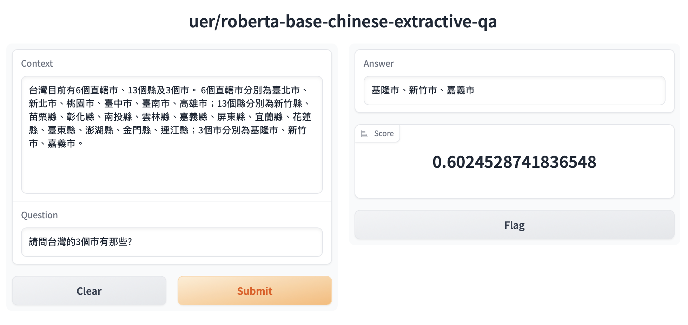
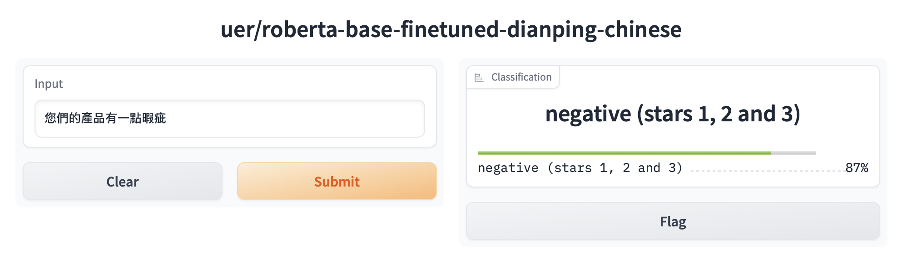

# Transformer 基礎知識和環境安裝

## 常見自然語言處理任務
- **情緒分析(sentiment-analysis)**
- **文本生成(text-generation)**
- **命名實體識別(Named Entity Recognition)**
- **閱讀理解(question-answering)**

	- 給予一編相關文章和問題,從文章內取得答案

- **填充答案(fill-mask)**

	- 填充題目的回答

- **內容摘要(summarization)**
- **翻譯(translation)**
- **特徵提取(feature-extraction)**
- **對話機器人(conversation)**

## Transformer簡單介紹
- HuggingFace出品,常用的自然語言處理套件之一
- HuggingFace提供了大量基於Transformer架構的預訓練模型,除自然語言外還有圖像,音頻和多模態的模型
- 良好的分數和提供大量數據集,也支援使用者上傳
- 快整實現預訓練模型的fine tune

## Transformers相關的套件包
- **Transformers**
	- 核心套件
	- 模型加載
	- 模型訓練
	- 流水線

- **Tokenizer**
	- 分詞器
	- 對數據進行預處理
	- 內容到token序列互相轉換

- **Datasets**
	- 資料集,提供資料集的下載和處理

- **Evaluate**
	- 評估功能,提供各種評價指標的計算函式

- **PEFT**
	- 高效微調模型,提供幾種高效能微調方法

- **Accelerate**
	- 分布式訓練

- **Optimum**
	- 最佳化和加速,支援Onnxruntime, OpenVino

- **Gradio**
- 視覺化介面部署


## 環境安裝
1. **重要的安裝**
- pytouch
- git
- github帳號
- hugging face帳號
- vscode
	- jupyter
	- python
- miniconda

2. 套件安裝(conda install)

- transformers
- datasets
- evaluate
- peft
- accelerate
- gradio==4.44.1(範例才可以執行,5.x版以上要python3.10)
- optimum
- sentencepiece
- jupyterlab
- scikit-learn
- pandas
- matplotlib
- tensorboard
- nltk
- rouge

## 測試
### Question Answering的測試

```python
from transformers import AutoModelForQuestionAnswering, AutoTokenizer, pipeline
model = AutoModelForQuestionAnswering.from_pretrained('uer/roberta-base-chinese-extractive-qa')
tokenizer = AutoTokenizer.from_pretrained('uer/roberta-base-chinese-extractive-qa')
qa = pipeline('question-answering',model=model,tokenizer=tokenizer)
content='''
治療憂鬱症、暴食症以及強迫症的藥物「百憂解」，11月起全面退出台灣市場，「台灣禮來」今天發表3點聲明，包含基於公司策略調整，決定於「2024年底全球停止生產百憂解」，已請醫療專業人員暫停處方百憂解給新患者，也已遵循相關規定向主管機關報備。
百憂解是精神科老藥，因為不堪健保砍價，於今年8月停止供貨，日前遭披露，因市場策略調整，台灣禮來公司已申請撤銷百憂解的藥物許可證，於8月底停止供貨，並經衛福部9月13日公告生效，依「全民健康保險藥物給付項目及支付標準」，許可證註銷後，最快可於「次次月」1日取消給付，因此預計今年11月1日停止申報健保，屆時將無法申請健保給付，醫院必須尋找替代廠商，以利患者後續治療。
食藥署副署長王德原先前表示，百憂解20毫克的三同藥品還有5張藥品許可證，不會影響病人，且三同藥品為國產學名藥，為國內藥廠生產，可以依需求增加產量，藥品供應沒有問題；健保署醫審及藥材組參議戴雪詠日前指出，百憂解20毫克為健保收載超過30年的老藥，目前已有很好的、同品質的學名藥替代，百憂解更是在全球超過40年的老藥，現在已過專利期的老藥退出市場，由相同品質、藥價較低的學名藥接手，這是國際市場的常態。
'''
question=''
QA_input = {'question': "百憂解可以治療什麼病症?",'context':content}
print(qa(QA_input))
```

### Question Answering的測試

```python
import gradio as gr
from transformers import AutoModelForQuestionAnswering, AutoTokenizer, pipeline
model = AutoModelForQuestionAnswering.from_pretrained('uer/roberta-base-chinese-extractive-qa')
tokenizer = AutoTokenizer.from_pretrained('uer/roberta-base-chinese-extractive-qa')
qa = pipeline('question-answering',model=model,tokenizer=tokenizer)
demo = gr.Interface.from_pipeline(qa)
demo.launch()
```



### Classification的測試(sentiment-analysis)



```python
import gradio as gr
from transformers import AutoModelForSequenceClassification, AutoTokenizer, pipeline
model = AutoModelForSequenceClassification.from_pretrained('uer/roberta-base-finetuned-dianping-chinese')
tokenizer = AutoTokenizer.from_pretrained('uer/roberta-base-finetuned-dianping-chinese')
classification = pipeline('text-classification',model=model,tokenizer=tokenizer)
gr.Interface.from_pipeline(classification).launch()

```

